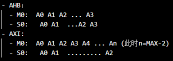
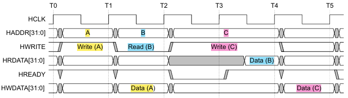
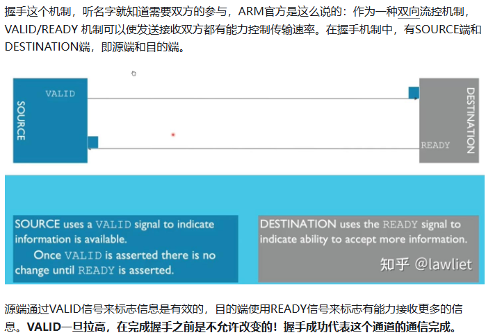
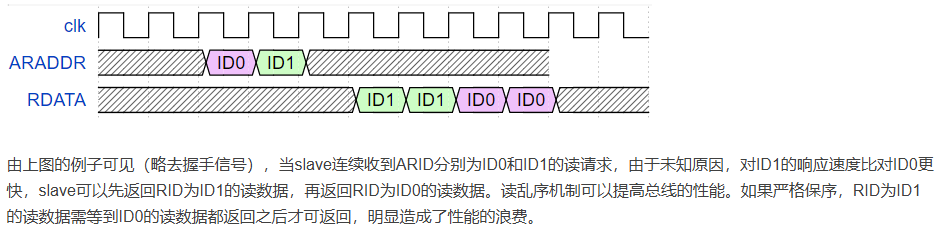
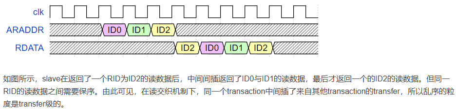

## reference ##
- 手册
- 
    https://zhuanlan.zhihu.com/p/641597910

## 梳理 ##
- ### AXI引入channel的概念，5个读写通道，支持同时读写；
  - AHB里，读写共用地址和控制和响应，即HADDR和HWRITE，以及HRESP和HREADYOUT；读写数据是分离的，即HWDATA和HRDATA；因此AHB无法同时读写；
  - AXI里，有5个读写通道，分别为写地址、写数据、写回应、读地址、读数据；因此AXI支持同时读写；
- ### AXI支持outstanding，提高主机传输效率；
  - AHB/APB只支持单笔传输完成后，主机才能传输下一笔数据；由于传输有delay，会导致主机一直需要等待，堵塞；
  - AXI支持一定数量的堵塞量，提高传输效率；
  - 以对地址A0,A1,A2,...的读写操作为例：
    
- ### 引入握手机制；
  - AHB支持2级pipeline的地址-数据控制；写数据延后写地址一拍（读数据本来就延后读地址n拍）
    
    关于为什么不能同时发送写地址和写数据，看到eetop上有一个解释：
    
  - AXI引入握手机制，对写地址和写数据的时序没有明确要求(5个通道有5组)
    
- ### AXI支持非对其访问；
  - 以总线位宽=32bit为例，AHB只能对齐访问0x0,0x4,0x8,...；而AXI能支持字节对齐访问，即访问0x1,0x2,0x3,...；
- ### 支持乱序，核心为ID号；
  - https://blog.csdn.net/qiuzhongyu123/article/details/121217249
  - transfer和transaction
    简单来说，一次传输即握手成功（任一通道握手都可以）就叫做一次transfer，有些场景也会叫做一次beat。而Transaction指的是传输一组数据所发生的所有的交互。
  - transaction ID：
    - Read transaction中，返回的读数据的RID需与相应读地址的ARID是一致的。
    - Write transaction中，写数据的WID及写响应的BID需与相应写地址的AWID是一致的。
    - Read transaction的ARID/RID与Write transaction的AWID/WID/BID即使相同也不具有相关关系。
    - 为了支持多主机对多从机的控制，因此从机的ID会拓展位宽，用于标记是哪个主机送出的；
  - 必须保序的情况（AXI接口要求）
    - 同一ARID的read transfer间需与address发出的顺序一致。
    - 同一AWID的write transfer间需与address发出的顺序一致。
    - 同一master发出的同一ID的transaction可能访问不同的slave，返回的RDATA或BRESP需要和发出的顺序一致。（即同一个ID transaction内部的transfer之间需要保序）
  - 无需保序的情况（即AXI中没有规定的/非必须保序，即需要和master确认，如果接口支持保序的话，master内部就无需加fifo来保序）
    - 不同master发出的transaction之间没有保序要求。
    - 不同ID的transaction之间没有保序要求。
    - AWID与ARID相同的transaction之间没有保序要求。
    - 乱序机制：
        为了解决顺序机制中，slave响应时间的不同，可能会导致传输效率受损问题，提出了乱序机制；因此乱序的根本是由于不同slave对不同读写要求的响应时间不同；
      - Out of Order
        - 读乱序：以同一个slave收到多个不同ARID的transaction为例（无所谓是否同一个master发出），此时slave返回的RID的顺序和收到的ARID顺序不同。
          - 【transaction颗粒度】
            
        其中读乱序的深度由read data reordering depth决定，代表slave中允许pending adress个数。当read data reordering depth = 1时代表不允许读乱序。
        - 写乱序：以同一个slave收到多个不同AWID/WID的transaction为例，此时slave返回的BRESP里的BID和收到的AWID/WID顺序不同。
        - 乱序深度（slave中暂存的地址数量）只和slave的设计有关，master无法决定；
      - Interleaving：其实是out of order乱序的一种形式【transfer颗粒度】
        - 读交织：
        
        - 写交织：相比于读交织，写交织还有两点额外的要求：
          - 虽然允许不同WID的写交织，但是每笔transaction的第一个transfer需与写请求（AW req）发送的顺序严格一致；
          - 为了避免死锁，支持写交织的slave必须一直支持写交织，不能某些时候支持，而某些时候不支持；
          - AXI4中开始不支持写交织了；也删除了写通道的WID；
- ### Burst只需要首地址
  - AHB中也支持master只给出首地址，就可以开启一次burst传输，但是总线上还是会给出对应的每个transfer的地址；因此无法做outstanding；
  - AXI中只要给当前burst的首地址，就可以继续给下一个burst的首地址，总线上不会给出对应的每个transfer的地址；因此才能做outstanding；

    > 

