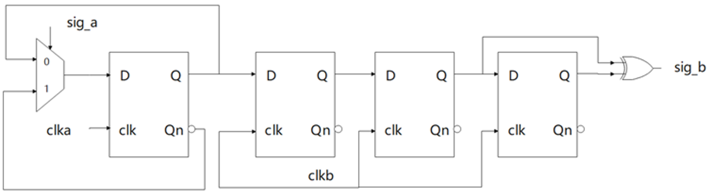
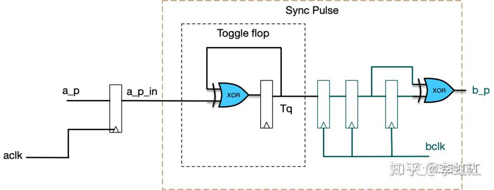

# 同步器设计和使用文档 #
## sync level
- 打两拍
- 满足目标域的3-edge原则（Tck1>1.5Tck2）
  - 如果高level/低level脉宽不满足3-edge，可能同步器采不到或者亚稳态
  - 如果慢时钟->快时钟域，也需要满足3-edge
## sync pulse
- 法1

    - 方式：clka域里来一个pulse，togg翻转一下，将togg从clka同步到clkb，还原pulse
    - 限制：可以做spi-->sys的同步（sck随时会掉，该sync支持）；两次pulse的间隔需要满足clkb的3-edge；
    - RTL coding
        ```
        //reset处理
        assign rstn = rstn1 & rstn2;
        assign rstn_scan = scan_mode?  scan_rstn:rstn;
        sync_reset_n sync1(.rstn_a(rstn),.clk(clk1),.rstn_s(rstn_scan1));
        sync_reset_n sync2(.rstn_a(rstn),.clk(clk2),.rstn_s(rstn_scan2));

        //脉冲pul1触发togg翻转电平
        always@(posedge clk1 or negedge rstn_scan1) begin
            if(~rstn_scan1)   
                togg <= 1'b0;
            else    
                togg <= pul1? ~togg1:togg1;
        end

        //togg电平打两拍同步
        sync_level synctogg(.clk(clk2),.rstn(rstn_scan2),.data_in(togg),.data_out(togg_sync));

        //从togg中还原出clk2域的脉冲
        always@(posedge clk2 or negedge rstn_scan2) begin
            if(~rstn_scan2)   
                togg_sync_d1 <= 1'b0;
            else 
                togg_sync_d1 <= togg_sync;
        end
        assign pul2 = togg_sync ^ togg_sync_d1;

        ```
- 法2

和法1类似
## 握手

## 低功耗同步策略
- 应用背景：<br>
  CardiffC中由于系统时钟最快128K，对于寄存器读写而言太慢了，所以普通寄存器直接用的spi clk，对于需要同步到sys的寄存器，从spi-->alon_sys的同步操作在sleep下占据了较大的功耗占比，因此在sync_pulse法1的基础上提出一种低功耗同步策略；
  - pul1_level = |pul1[i];
  - pul1_level打两拍同步到clk2--> pul2_level
  - pul2_level在clk2下打一拍-->pu2_level_d1
  - pul2_gate = pul2_level | pu2_level_d1
  - pul2_gate对clk2做gate-->clk2_gt
  - 对每个pul1[i]在clk1下-->togg[i]-->在clk2_gt下-->togg_sync,togg_sync_d1-->pul2[i]
- 限制：<br>
  - 适用于非alon时钟域到alon时钟域的同步；
  - 一起同步的pul1[i]互相之间的脉冲有间隔要求，需要满足clk2的3-edge要求；
  
