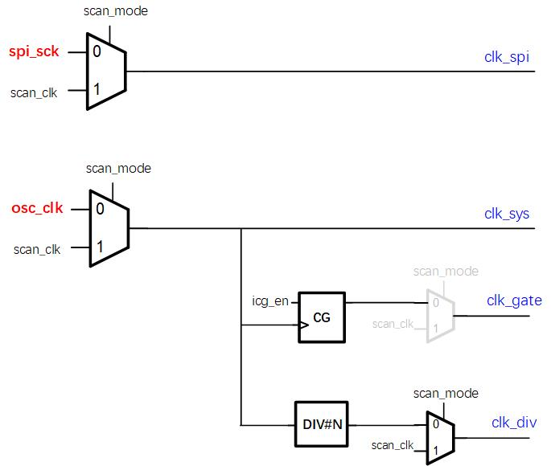
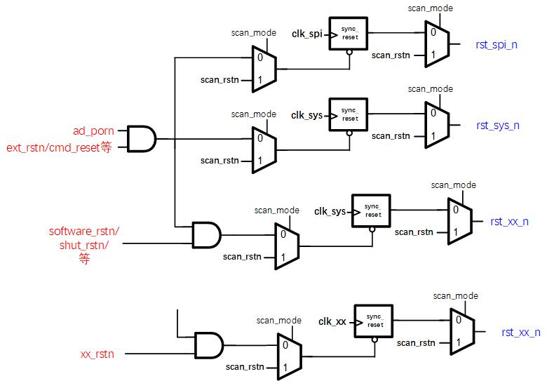

# CRGU #
用于产生各个模块的clock和reset信号

## clock产生电路
- ### 示例

- ### notion
1. clock的几种情况：
   - src->dest: 
     - 只需插scan mux
   - 经过clock gate：
     - 使用icg的common cell（EN用CLK_INV作LAT，gclk=en_lat & CLK）\
     - icg_en需要作sync同步处理（否则lat可能会有timing vio）
       - 啥时候不用做：比如初始配置的rg作门控，此时配完芯片才会工作；或者长电平信号做gate时也可以不插，有vio也没事？
     - icg后是否要插入scan mux？PacificS没插，如果用common cell，scan_clk可以穿过icg
   - 分频
      - 一般都是2的幂次分频，比如CardiffC中为了方便分频，将128K在产测阶段trim到131.072K处理
      - divider后面插入scan mux
2. clock path上scan mux的考虑
    - 设计目的
      - 芯片正常工作时，各寄存器使用片上的正常时钟和复位信号，但在进行scan test时，时钟和复位应该分别是来自PAD的scan_clk和scan_rstn信号，在进行前端设计时，需要加入scan mux，将芯片内部的时钟和复位bypass掉，选用scan_clk和scan_rstn，即DFT需要对电路的Controllability(可控性).
    - 时钟源
      - 各异步时钟域的源时钟以及数字逻辑产生的时钟后面，都要加上scan mux，以在scan mode下选择scan_clk
    - 时钟门控
      - 经过clock gating产生的时钟，因为时钟可以认为是直接穿过gating（为了保证综合工具能正确识别clock gating，在verilog中使用clock gating必须采用例化common cell的方式），而不必定义新的时钟，所以无需加scan mux。由于现在DFT对at-speed test的需求，很多时候不再单纯地使用scan mux去选择clock，而是使用OCC（on chip clocking），频率高的时钟使用HOCC，频率低的时钟使用LOCC。
      - 时钟门控的enable信号来自电路中的寄存器或组合逻辑产生的信号，在scan shift过程中，可能导致这些信号意外变成0，导致时钟被gate掉，所以clock gating的实际使能信号应该是enable | scan_mode，保证在进行scan test时时钟不会被关闭。实际工程中，clock gating cell除输入和输出时钟（一般分别是clk和gclk端）外，会有EN和TE两个输入端口，EN端接function下的所需要的控制信号，TE端接scan_mode信号，这两个信号会在cell内部做或运算，作为ICG真正的EN信号。另外在比较复杂的DFT测试中，TE端可能并不是接scan_mode信号，而是scan_enable信号，从而使这个cell并不是在scan mode下一直常通，而是可以通过ATE进行控制。通常测试情况下，scan_enable应一直为1，即所有的flip-flop都进入scan chain进行测试，但是ATE也可以通过选择性地将scan_enable置0，由EN端去控制gating的开关，使gating后的寄存器没有时钟，观测整个chain的行为是否符合预期，以测试EN端是否发生了stuck-at fault，这需要使用和一般scan test下不同的test pattern。
    - 时钟分频
      - 时钟分频产生的时钟，后要加scan mux，从而后面的DFFs都用的scan_clk（而不是分频后的scan_clk）
      - 在scan ac测试中，为了保证at-speed测试时所选择的func clock是电路signoff的最高频率，CRG中的时钟应保证没有分频（即1分频），其中的divider的div值在scan_ac_mode下应该直接bypass为1，而不是选择来自寄存器或其他硬件控制电路的值。同时CRG相应电路不应该在ac 测试的scan阶段被串入scan chain，保证在at speed测试中CRG正常工作。这一点一般是通过dummy reg，在ac mode下将CRG电路从scan chain中bypass掉。
    - 时钟MUX
      - 如果某个MUX的sel信号是rg，且该rg收到MUX输出的时钟信号驱动，则需要在scan_mode下将该rg拉到固定值，否则在scan_mode下该rg的翻转（因为scan chain会shift所有寄存器）会导致MUX输出时钟有毛刺（虽然此时MUX的A1,A2都应该为scan_clk，但MUX有延迟），或者在MUX后插入scan MUX，保证scan下能过稳定的scan_clk；
      - 如果是动态的时钟切换，需要用特殊的时钟切换common lib cell；如果是静态的时钟切换，只需要基本的CKMUX；
3. clock产生电路中的MUX要例化CK专属的MUX；时钟门控要用common cell；有过个分频时，可以考虑复用分频计数器，减小开销

## reset产生电路
- ### 示例
  

- ### notion
1. 复位源分类
   - 全局复位：
     - ad_porn：模拟复位
     - PAD_RSTN：IO复位
     - cmd_reset：指令复位
   - 局部复位：
     - software_rstn：软件复位（包括寄存器W1C复位）
     - shut_rstn：PMU产生，用于复位shut domain电路
2. 异步复位，同步释放
   - 注意同步释放时所用的clk，是采用alon？采用多个同步clk中的的快时钟？具体情况具体分析
   - CardiffC中，同步的一堆分频时钟中，都用的128K释放（及时），且都用的alon（不出错，提前退出复位，及时给出释放后响应）
3. 复位path中的scan mux考虑
   -  芯片上的复位源来自模拟电路或数字电路，因为在scan shift过程中寄存器的值并不确定，如果复位信号的部分或全部来自数字电路，可能由于产生复位的寄存器值变化，导致复位被意外触发，测试失败，因此，同样需要加入scan mux，在scan mode下选择scan_rstn；
   -  问了DFT同事，必须保证送到各个模块的复位在scan_mode下==scan_rstn（第一准则）
   -  任何由组合逻辑产生或由复位同步器产生的复位信号，都要加入scan mux
   -  组合逻辑产生的异步复位信号--> scan mux--> 同步释放 -->scan mux（其中同步释放前的scan mux也可以不插，毕竟后面那个scan mux可以保证送出去的是scan_rstn；前一个可插可不插，插了提高点覆盖率）
   -  对在RTL阶段没有给复位加入scan mux的寄存器，工具可以再次进行插入，但考虑到可能只有部分寄存器没有插入，简单起见会给所有寄存器再插一遍。当然，在前端保证设计的正确性是我们理应做到的，所以应尽可能保证所有寄存器在RTL阶段就已经有了scan mux。
4. 复位RDC问题
   - 比如SPI产生的cmd_reset，作为全局复位信号产生rst_spi_n，导致cmd_reset在前仿中呈现为0ps毛刺（VCS中加命令可以观测，否则肉眼难以观测，但是assert可以捕捉到），该回环问题在spyglass中会报RDC，CardiffC中暂时不做修改，后仿中做check；
   - 更新：CardiffC中将cmd_reset-->cmd_reset_d1后送到crgu做复位逻辑，其中delay用到DFF的复位接的是处理后的rst_por_n；同样rx_reset_d1也是，剔除原先复位中自己涉及的部分；
5. “组合逻辑环问题”
  - CardiffC中DV报CRGU中存在组合逻辑环问题：根据分析可得，ad_porn拉低会导致该路径上所有寄存器复位（都是reset-q）确实是组合逻辑环，并且由于是偶数个reg(reset-q等效成inv)，各个节点死锁在0，此时是符合复位行为的；但ad_porn一旦拉高，其中一个reg的CK接的是alon时钟，该reg一定复位释放，从而激活reg的D-Q，该寄存器的激活直接打破了组合逻辑环的死锁（此时就不是组合逻辑环了）
6. 关于crgu path中直接例化CKMUX之类的stdcell问题
   - 一般出现在clk和rstn的最后一级
   - 个人猜测是为了综合时能用驱动能力较大的MUX，而不是综合成普通MUX
   - 涛哥的解释是，clock最后一级用CKMUX方便中后端定位
