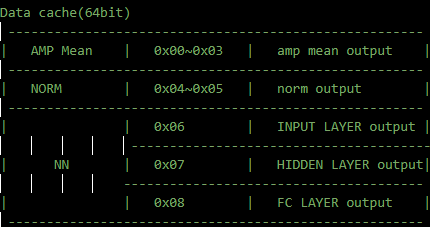
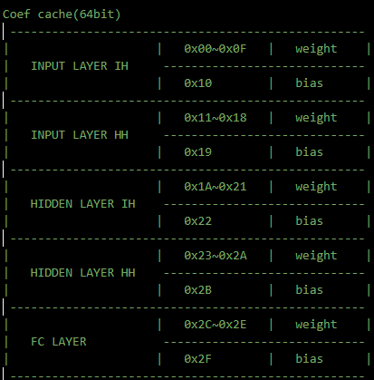

### amp_cal
- 功能
  - 接收四个相位的pixel adc data，计算5x5个pixel的amp mean（幅度均值）；
  - 四个相位的顺序是：phase0-phase180-phase90-phase270
  - $AMP(i) = \sqrt{{I_i^2 + Q_i^2}}$
    - $I(i) = (phase0 >> 1) - (phase180 >> 1)$
    - $Q(i) = (phase90 >> 1) - (phase270 >> 1)$
  - $AMP_{MEAN} = \frac{\sum_0^{24}AMP(i)}{25}$
  - amp cal完成计算后，给出amp_mean和amp_mean_vld，并拉高amp_trig_norm，触发norm_cal；
  - amp_cal同时也支持IQ计算输出（略）
- 模块设计
  - FSM设计
    - 状态切换过程
      
      IDLE (adc data vld) → PHASE0T90（处理完phase90，即进入最后一个相位）
      
      → SQUARE_I(delay 2拍) → SQUARE_Q(下一次有adc data vld) → SQRT_IN（直接跳） →

      ……（循环共25次）

      → WAIT_SQRT(sqrt_out_vld) → MEAN(div_out_vld) → DONE(无条件) → IDLE  

  - 数据通路
    - phase0和phase90期间，amp_cache按序存入5x5个12bit的(adc_data >> 1)，并分别写入cache的0x9~0xd(phase0)和0xe~0x12(phase90)（cache一个地址存64bit）
    - phase180期间，amp cache按序写入5x5个12bit的（phase0(从cache的0x9~0xd中读出的) >> 1 - adc_data >> 1），并写入cache的0x9~0xd；
    - phase270期间，开始交替做5x5次SQUARE_I → SQUARE_Q → SQRT_IN，SQUAR_I(i)期间从cache中读出12bit的I(i)，算平方，将24bit计算值存到amp_cache高半截；SQUAR_Q(i)期间，计算（phase90(从cache的0xe~0x12中读出的) >> 1 - adc_data >> 1），算平方，将24bit计算值存到amp_cache低半截；SQRT(i)期间，将24bit无符号$I^2+Q^2$送入sqrt unit，计算得到开根结果，给出sqrt_out_data和sqrt_out_vld；
    - 根据每次SQRT(i)给出的sqrt_out_data和sqrt_out_vld，进行累加，得到amp_acc；WAIT_SQRT结束时给出amp_acc_vld；
    - MEAN期间，div根据amp_acc_vld锁存此时的amp_acc，并除以25，求平均，给出amp_mean和amp_mean_vld；

### norm_cal
- 功能
  - 将来自amp_cal的amp_mean存储在data cache中，每4个amp_mean组成64bit，写入data cache的一行；16个就是4行；
  - 首次FDT时，需要写足（rg_fdt_tseq_num+1）*4个数据，触发NORM流程；后续每次来amp_mean，都会触发一次NORM流程；
  - NORM流程如下：
    - 遍历latest的16个amp_mean（rg<3不足16个时以最新一次数据做padding），寻找max和min，计算ptp=max-min，同时累加该16个amp_mean，除以16得到$mean(AMP_{mean})$；
    - ptp值送到lzc_unit找到最高位1的index，得到$N=lzc(max(AMP_{mean})-min(AMP_{mean}))$
    - 再次按先后顺序读出amp_mean，计算得到归一化的值：$NORM = \frac{(AMP_{mean}-mean(AMP_mean)) \times dataratio}{2^N}$
    - 经过饱和处理后，得到8bit的有符号的norm_result，每8个组成一行写入data cache，所以总共16个norm result占据2个data cache地址；

- 模块设计
  - FSM设计
    - 状态切换过程
        
        STORE_MEAN(amp_mean_vld，若数据不足时) → WORK_DONE(直接跳转) → STORE_MEAN

        ……（以上循环共16-1次）

        → STORE_MEAN(amp_mean_vld，若数据量足够时) → PTP_PRE(cache_rdata准备好了) → SEARCH_PTP(4行cache rdata都遍历完了) 
        → NORM_PRE(cache_rdata准备好了) → CAL_NORM(4行cache rdata都遍历完了) → WORK_DONE(直接跳转) → STORE_MEAN
      

  - 数据通路
    - 数据量不足16个时，每4个amp_maen按store_slice_cnt（0~3）拼接存入data cache中的一行，16个amp_mean存储在data cache的0x0~0x3中；
    - 数据量达到16个(或者rg配置的个数)，每次amp_mean_vld拉高，amp_mean_16bit写入norm_cache[对应的slice_cnt]，并写入data cache对应位置；
    - PTP和NORM计算期间，按序读出data cache的0x0~0x3中的数据，如果数据量不足就开始做归一化，则用最新的数据padding rdata，得到cache_rdata_gather；
    - SEARCH_PTP和CAL_NORM期间遍历amp_mean时，如果amp数据被写入norm cache但还没被读出，则从norm cache[slice_cnt]中加载，否则从cache_rdata_gather[slice_cnt]中加载，加载得到amp_data_from_cache_12b；
      - SEARCH_PTP期间
        - 遍历16个amp_data_from_cache_12b时，使用max_buf和min_buf得到max和min，并计算ptp，同时累加16个amp_mean得到amp_mean_acc和amp_mean_mean(amp_mean_acc >> 4)；==> 12bit的amp_mean_mean
        - ptp送进lzc_unit，得到为1的最高bit索引(range_N_index)；==> range_N_index
      - CAL_NORM期间
        - 遍历16个amp_data_from_cache_12b时，计算amp_diff_ratio_20b = ($signed(amp_data_from_cache_12b) - $signed(amp_mean_mean)) <<< rg_norm_data_ratio
        - 对amp_diff_ratio_20b做饱和处理和2^range_N_index，计算得到: norm_result_16b = $signed(sat(amp_diff_ratio_20b)) >>> range_N_index;
        - 对norm_result_16b做饱和处理，得到norm_result_8b；按序将16个8bit的norm_result_8b拼接成2个64bit；CAL_NORM做完后，2个64bit数据依次写入data cache的0x4~0x5中；
    - CAL_NORM结束后，给出norm_done和norm_trig_NN；NORM数据存放在data cache的0x4~0x5中；

### NN_unit
- 功能
  - NN unit的network(参考python model)
    - INPUT_LAYER(h_front_l0 = h_0[0:1])
      - h_l0_ih = W_ih·input + b_ih
      - h_l0_hh = W_hh·h_front_l0 + b_hh
      - h_l0_x = h_l0_ih + h_l0_hh
      - h_l0 = ReLU(h_l0_x)
    - HIDDEN_LAYER(h_front_l1 = h_0[1:2])
      - h_l1_ih = W_ih·h_l0 + b_ih
      - h_l1_hh = W_hh·h_front_l1 + b_hh
      - h_l1_x = h_l1_ih + h_l1_hh
      - h_l1 = ReLU(h_l1_x)
    - FC_LAYER
      - out_updown = W_fc·h_l1
      - h_0 = [h_l0,h_l1]
  - 一层NN layer的算子
    - ht = ReLu(W_ih·xt + b_ih + W_hh·h_font + b_hh)
    - 其中xt是当前数据，作为子层IH的输入；h_font是t-1时刻GRU的状态输出，作为子层HH的输入（t0时刻h_font=0）
  - INPUT LAYER(INT 8bit)
    - IH:   output[1,8] = input[1,16] · weight[16,8] + bias[1,8]
      - output: nn_ih_cache[8bit x 8个]
      - input: NORM output @data_cache(0x4~0x5)
      - weight: @coef_cache(0x00~0x0f)
      - bias: @coef_cache(0x10)
    - HH:   output[1,8] = input[1,8] · weight[8,8]
      - output: nn_hh_cache[8bit x 8个]
      - input: @data_cache(0x6)
      - weight: @coef_cache(0x11~0x18)
    - RELU:  output = RELU(IH+HH)
      - output: @data_cache(0x6)
  - HIDDEN LAYER(INT 8bit)
    - IH:   output[1,8] = input[1,8] · weight[8,8] + bias[1,8]
      - output: nn_ih_cache[8bit x 8个]
      - input: @data_cache(0x6)
      - weight: @coef_cache(0x1A~0x21)
      - bias: @coef_cache(0x22)
    - HH:   output[1,8] = input[1,8] · weight[8,8]
      - output: nn_hh_cache[8bit x 8个]
      - input: @data_cache(0x7)
      - weight: @coef_cache(0x23~0x2A)
    - RELU: output = RELU(IH+HH)
      - output: @data_cache(0x7)
  - FC LAYER(INT 8bit)
    - output[1,3] = input[1,8] · weight[8,3] + bias[1,3]
      - output: @data_cache(0x8)
      - input: @data_cache(0x7)
      - weight:@coef_cache(0x2C~0x2E)
      - bias: @coef_cache(0x2F)

- 模块设计
  - FSM设计
    - NN_unit状态切换过程
        
        IDLE(NN_unit_start) → INPUT_LAYER(NN_layer_done) → HIDDEN_LAYER(NN_layer_done) → FC_LAYER(NN_layer_done) → LABEL_DEC(dec_result_vld) → DONE(直接跳转) → 
        

    - NN layer状态切换过程
        【初次FDT】
        【INPUT LAYER】

        IDLE(NN_layer_start) → SUBL0_MUL(state_cnt==subl0_weight_addr_num) → SUBL0_ADD(几拍且初次FDT) → SUBL1_ADD(几拍) → SUBL_SUM(几拍) 
        
        【HIDDEN LAYER】

        → IDLE(NN_layer_start) → SUBL0_MUL(state_cnt==subl0_weight_addr_num) → SUBL0_ADD(几拍且初次FDT) → SUBL1_ADD(几拍) → SUBL_SUM(几拍)

        【FC LAYER】

        → IDLE(NN_layer_start) → SUBL0_MUL(state_cnt==subl0_weight_addr_num) → SUBL0_ADD(几拍且FC) → SUBL_SUM(几拍) 

        【INPUT LAYER】

        →IDLE(NN_layer_start) → SUBL0_MUL(state_cnt==subl0_weight_addr_num) → SUBL0_ADD(几拍且初次FDT) → SUBL1_MUL(state_cnt==subl1_weight_addr_num) → SUBL1_ADD(几拍) → SUBL_SUM(几拍) 

        【HIDDEN LAYER】

        → IDLE(NN_layer_start) → SUBL0_MUL(state_cnt==subl0_weight_addr_num) → SUBL0_ADD(几拍且初次FDT) → SUBL1_MUL(state_cnt==subl1_weight_addr_num) → SUBL1_ADD(几拍) → SUBL_SUM(几拍) 

        【FC LAYER】

        → IDLE(NN_layer_start) → SUBL0_MUL(state_cnt==subl0_weight_addr_num) → SUBL0_ADD(几拍且FC) → SUBL_SUM(几拍) 

        ……

  - 数据mapping

    

    

  - 数据通路
    -

### fdt_ctrl
