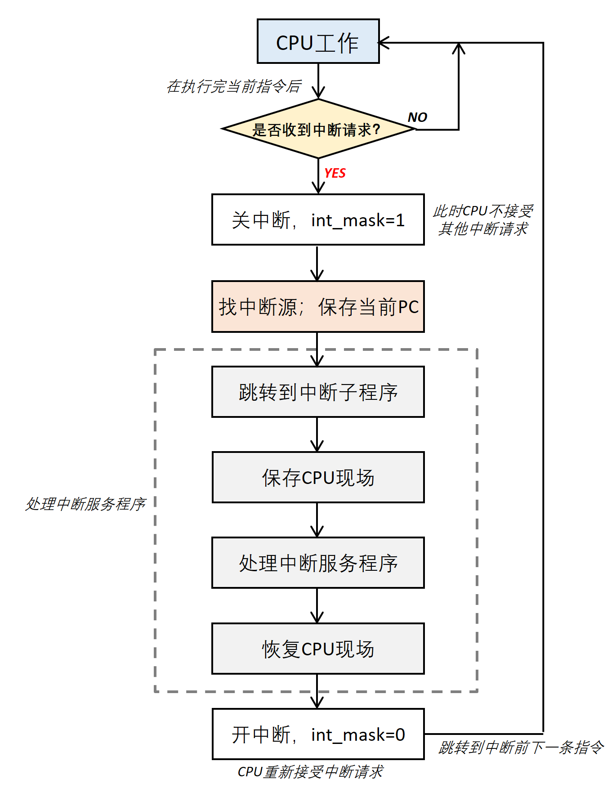

# INT CTRL 
## Overview
收集各个模块的中断请求，将用户需要观测的中断按照配置，以一定形式通过PAD送给主控，并将中断状态记录在ro_int_status中； 
主控接受到中断后，可以读取中断状态，通过写寄存器清除对应中断状态；
## Features
- 中断类型
  - 高电平：int_out高电平有效，当有使能的中断请求时，int_out一直为高电平（为啥他不需要遵循gap
  - 低电平：类似，int_out低电平有效（reset时int_out应该是低电平还是invalid电平？
  - 高脉冲：int_out以一定的周期打出规律的脉冲（为啥？）为了保证脉冲信号的规则性，需要遵循脉冲gap调制机制（为啥？给主控响应时间）
  - 低脉冲：类似，同样是reset问题
- 中断使能
  - 控制该中断源触发的中断是否要送到int_out
  - 一般默认只开启芯片复位中断使能
- 中断源
  - 包括了芯片复位中断、其他模块产生的中断、定时器中断、用户中断等；
  - 芯片复位中断：每次芯片reset释放后，产生一个中断请求；用于告知主控芯片被复位，主控判断是正常复位还是异常复位；
  - 定时器中断：单次和自动mode；
  - 用户中断：主控可以触发中断——用户对该寄存器W1C，并在info寄存器中记录中断信息；
  - 特殊中断，比如Cardiff C中的数据异常中断，在模块的中断源未拉低时，用户无法清除该中断；
- 冷却时间机制（只针对脉冲类型）
  - 目的：在脉冲模式下，主控根据int_pulse的边沿触发中断，主控处理中断需要时间，且过于频繁的中断会消耗功耗，因此引入cold time。
  - 行为：脉冲模式下，打出一定脉宽的int_pulse后，间隔一段时间后，如果enable的中断状态未被清除，则继续打出int_pulse，直至全部清除；
  - CardiffB&C中cold time=1ms~64ms
- 脉冲间隔调制机制（CardiffC只针对脉冲类型，Sierra电平也遵循）
  - 目的：在脉冲模式下，主控根据int_pulse的边沿触发中断，过于频繁的中断触发会消耗大量功耗，因此要求前后两个打出的int_pulse之间间隔>1ms（CardiffC中要求，但是B中有遗留问题）；对于电平模式，主控根据int_level电平触发中断，不太一样，频繁的中断请求不会导致主控被频繁触发，因此不需要引入脉宽调制机制；
  - 行为：对打出的int_pulse有间隔要求，一般cold time默认满足，但是前一次中断被清除后短时间内触发第二次中断时，该机制会强行将第二次中断触发的int_pulse拉到要求的间隔打出；CardiffC中建议int pulse间隔都能保证gap间隔打出；
- after-frame机制
  - 目的：避免采样过程中中断请求过于频繁打断采样，会将除了sample-rate-error之外的中断配置成after-frame机制；
  - 行为：frame期间触发的中断，latch到frame done时触发并更新中断状态；
- 清除中断
  - 用户写1清除
  - 用户读清
- 中断状态寄存器
- 中断自唤醒

## 系统视角下的INT ##
**只有了解了系统用户层面对模块的应用场景、应用需求，才能更好得理解需求&设计模块&解决问题。**

系统一般通过中断或者轮询的方式和外设进行交互
- 轮询方式
  - CPU/MCU(系统)定时执行轮询指令，查询外设接口的状态(flag)，查询是否需要从当前PC跳转到设备服务程序进行处理；
  - 系统主动从接口访问外设的状态；
  - 此时enable为全0；
- 中断方式
  - 系统收到INT后响应，从中断状态寄存器中读取中断状态，确认外设状态，从当前PC跳转到中断子程序处理中断，处理完成后系统清除中断状态，返回中断时下一条指令；
  - 中断过程
    

- 轮询和中断的区别
  - 安全性--CPU控制权
    - 轮询：CPU定时·轮流check各个接口的状态-->CPU将控制权交给服务应用程序；如果程序死锁，OS无法夺回CPU控制权；
    - 中断：如果有定时中断，可以在执行中断服务程序时通过定时中断重新夺回CPU控制权；（此时定时中断不应该被mask？）
  - 可扩展性--更改接口和外设
    - 轮询：修改更麻烦，没有可移植性；
    - 中断：可扩展性更强，只需要更改位宽，灵活高效；