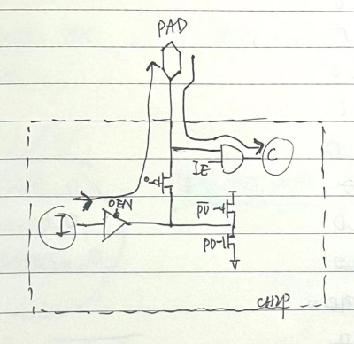

# PAD & PINMUX #
例化PAD，控制PAD的属性，根据pin分配情况产生pinmux和tmux，插入test logic for dft

## 例化PAD
根据工艺提供的PAD model以及PAD的属性，例化PAD，以下以常用的PAD和属性举例：

| PIN NAMD | default func | default dir | func1 | func1 sel | func1 dir| … | test func | test sel | test dir|
| ---- | ----- |----- |---- | ----- |-----|-----|-----|-----|-----|
| INT |  int_out  |  O   | MPX0 | rg_mpx0_en | O | … | scan_rstn|test_se|I|
| SYNC |  sync_in  |  I   | MPX1 | rg_mpx1_en | O | … | scan_xx|test_se|I|
| SCLK |  spi_sck_in  |  I   | adc_ck_out | rg_adc_test_en | O | … | scan_xx|test_se|I|
| CSN |  spi_csn_in  |  I   | adc_data0_out | rg_adc_test_en | O | … | scan_xx|test_se|I|
| MOSI |  spi_mosi_in  |  I   | adc_data1_out | rg_adc_test_en | O | … | scan_xx|test_se|I|
| MISO |  spi_miso_out  |  O   | gpio | rg_gpio_en | IO | … | scan_xx|test_se|I|
| RST |  rst_in  |  I   | xx | xx | xx | … | scan_xx|test_se|I|


- ### PAD常见属性列表（一般会提供真值表）

    | 属性 | 描述 | notion|
    | ---- | ----- |---|
    | PAD | 真实连接到PAD的信号 | 顶层信号 |
    | I | PAD作输出时，chip_out内部信号连接到 I->PAD | 比如int_out|
    | C | PAD作输入时，PAD->C送到chip内部 | 比如sync_in |
    | IE | 输入使能，高有效| 有时候会用IEN，低电平有效|
    | OE | 输出使能，高有效|有时候会用OEN，低电平有效|
    | PD | 下拉使能 | 一般寄存器配置，只有输入有上下拉配置|
    | PU | 上拉使能 | 一般寄存器配置，只有输入有上下拉配置|
    | DS | 驱动能力 | 一般寄存器配置，一般默认用最大驱动能力 |
    | xx | core power down| AD_5VIO直连，5V经过数字电路会击穿|
    |

- ### 例化示例

实际上会用gen_pinmux.py脚本生成的信号去连接
```
//单向PAD--只做输入
PAD模块 spi_csn_pad(
	.PAD(SPI_CSN),    //PAD端口
	.OEN(~spi_csn_oe),   //根据pinmux产生
	.I(1'b0),         //I->PAD
	.IE(spi_csn_ie),    //根据pinmux产生
	.C(spi_csn_in),   //PAD->C
	.PU(xx),            //
	.PD(xx),            //
	........
);
//双向PAD--在CSN有效时为输出，无效且不做其他复用时，输入
PAD模块 spi_so_pad(
	.PAD(SPI_SO),     //PAD端口
	.OEN(~spi_so_oe),   //根据pinmux产生
	.I(spi_so_out),   //I->PAD
	.IE(spi_so_ie),    //根据pinmux产生
	.C(spi_so_in),   //PAD->C
	.PU(xx),            //
	.PD(xx),            //

	........
);
```

- ### PAD model电路（示例）
  
  

- ### Q&A
1. default和reset时IO PAD的状态问题
    
   - 此时输入输出状态是否与defualt func一致？
   - 作为input，没有信号输入时，ie和C是什么状态？
     - 以CSN为例，上电后芯片处于复位，此时PAD_xx上是否有信号输入？此时PAD_CSN的ie=1吗？是否需要上拉？===个人认为，此时PAD_CSN的ie=0，或者外部高阻此时ie可以=0/1
     - Answer：PAD是输入时（即ie=1），此时对外即为高阻；输入PAD.C就是应该跟着PAD即时变化
     - 若多芯片相连，本未片选时，此时PAD_XX是有信号的（只不过是给别的芯片），那么此时PAD_CSN的ie应该为0，个人觉得可以内部上拉（如果有的话）？？？？？？？？？？划掉
   - 作为output，没有信号输出时，oe和I是什么状态？
     - 以INT为例，上电后芯片处于复位，此时内部int_out=复位值，个人觉得此时PAD_INT的oe可以=1，当然也可以下拉，此时PAD_INT上送出复位值问题不大
     - Answer：输出没有高阻的说法，“INT默认输出且下拉”的意思是INT为输出，且输出PAD.I(int_out)的default=0；
     - 若多芯片相连，本未片选时，此时PAD_INT应该也不会和别的芯片连一起吧？个人认为保险起见（如果真一起了），那就把oe=0，如果输出经过三态门的话，输出为高阻；（划掉）
  2. 外部封装会将PAD上下拉或者拉高阻问题
      - 如果外部会将PAD拉到相应所需的状态，首先外部通过什么方式？何时操作？其次此时内部需要对PAD做怎么样的操作吗？ 
  
- ### notion
1. Cardiff C中，SYNC由于封装，可能难以拉出来，因此无法用于ADC TEST、DFT功能，且在SYNC上做MPX也仅限于insignificant signals；
2. SPI相关PAD复用，仅限于复用给DFT、ADC TEST等进入该状态后，不会再使用spi的功能；无法复用给MPX和GPIO，因为这几个功能还在SPI可能恢复工作范畴内；
3. 对于PAD的属性要求：
   - 默认高阻：
     - 只有输入有高阻的说法，即PAD.IE=1；
     - 此时输入PAD.C即时跟着PAD变化
   - PAD默认上下拉：
     - 只有PAD为输入时会受到属性的PAD.PD/PU影响（？？待确定
     - PAD作为输出时，满足PAD.I的default=0/1，满足所谓的“上下拉要求即可”
   - 特殊要求：
     - SPI_MISO：要求CSN有效时，默认为输出；CSN无效且未被复用为其他功能时，默认为输入（高阻），在pad_ctrl中根据spi_csn_iin控制对应的pad ie/oe即可；
4. PAD的上下拉
   - 上拉、下拉电阻方式：
     - 对于输出PAD，意义不大；因为输出电阻Ro << Rp，因此并联后Ro’≈Ro，只是略微增大了驱动电流，没有真正起到上下拉的作用；
     - 对于输入PAD，因为输入电阻Ri >> Rp，因此通常的作用是将信号线强制箝位至某个电平，以防止信号线因悬空而出现不确定的状态，继而导致系统出现不期望的状态；
   - PNMOS上下拉方式：
     - 对于输出PAD，不会使能PU/PD；
     - 对于输入PAD，根据上下拉需求控制PU/PD；
5. 问题记录
   - 在配置和连接正确时，仿真出现X态：仿真环境对PAD force了激励，当该PAD作为输出时，in out对冲产生X态；
   - fpga验证，PAD_MOSI在spi-->test out切换时，从输入切换成输出，PAD输出X态：spi写rg，rg使能后切换pad模式，PAD_MOSI输入的最后一拍和test用PAD_MOSI输出可能重和，导致PAD_MOSI在这一刻同时有输入输出，在EDA验证上显示一拍的X态，但是FPGA PAD模型中（可能实际的pad也是）会避免这种搞坏PAD的risk，直接锁死，所以FPGA验证发现切换后PAD输出一直不变；（可以EDA复现定位一下）

## PAD_CTRL
产生部分PAD控制信号

- 根据gen_pinmux.py，一部分ie oe放到pinmux中产生了，因此PAD_CTRL用于产生剩余的PAD控制信号，比如ds、pe等（寄存器控制，过scan mux……）
- 产生一些特殊ie oe等控制，比如
```
assign {spi_miso_ie,spi_miso_oe} = spi_csn_iin? 2'b10:2'b01;
//根据csn是否有效，决定default时MISO PAD的方向：输入高阻or输出
```

## PINMUX & TMUX
根据pinmux表格，分配产生对应PAD的pin、pout、pie、poe，并送到tmux；

tmux根据test mode下对PAD的复用情况，进一步分配产生最终的tin、tout、tie、toe，用于例化PAD

```
assign {PAD_INT_poe,PAD_INT_pie,PAD_INT_pout} = //tmux.v中产生的送给PAD端口的信号
        scan_mode?  {net_zero,net_one,net_x}: //test下作输入
                    {PAD_INT_toe,PAD_INT_tie,PAD_INT_tout}; 
assign {PAD_INT_toe,PAD_INT_tie,PAD_INT_tout} = //pinmux.v中产生的送给tmux的信号
        rg_mpx0_en?  {net_one,net_zero,mpx_0}: //MPX下作输出
                     {net_one,net_zero,int_out}; //默认INT作输出
                     //{net_zero,net_one,net_z} //当PAD默认作输入时        
                     //{spi_miso_oe,spi_miso_ie,spi_miso_iout};//PAD_MISO的默认状态                    
```
## TEST LOGIC

用于产生DFT所需的test信号，芯片通过寄存器使能test功能，test logic产生相应的scan_mode，scan_enable（即test_se）、scan_clk、scan_rstn等信号。
- scan_mode：测试阶段一直为1（一旦用户打开rg_test_mode，则一直为高，直到下一次硬件复位）
- scan_enable：复用PAD，scan_enable=scan_mode & test_se_pad；在测试的shift阶段一定为1，但在capture阶段会由atpg工具推算scan_enable是否要为1（比如icg）

## 待整理
- PAD的驱动能力
  - scan_mode下要设置为最高
  - 正常工作时：如果ds设高，肯定能正常工作，但功耗增加；如果设低，可能驱动不够
- I2C的pull down enable
  - 复用为sda的PAD，需要根据sda_oe来mux(作为输出时tie0，作为输入时根据寄存器控制)