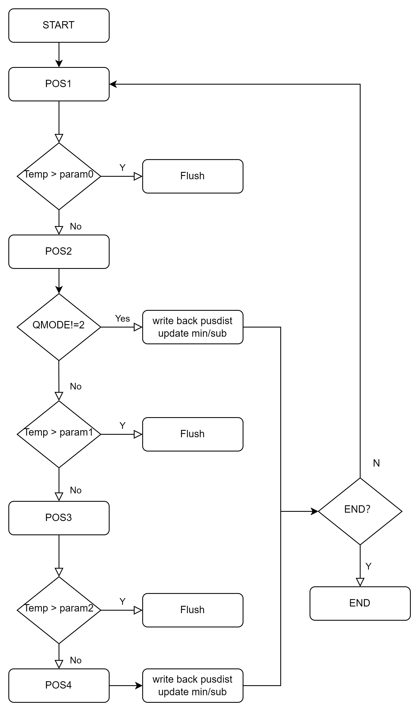
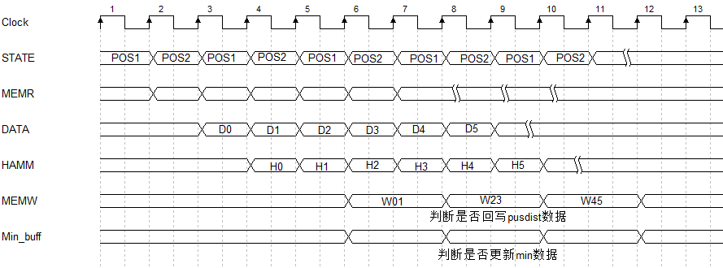
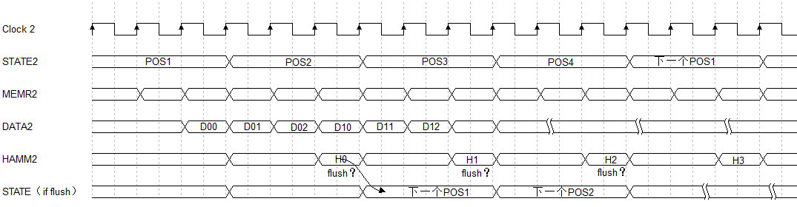

# GdHamdist设计文档 #
### 算子SPEC说明
- Gdhamdist算子通过计算两个特征图的特征点之间的汉明距离比较两个特征图之间的相似之处；
- 算子支持：
  - 单独调用MOCE_HammDistance函数；
  - 64bit/128bit/192bit的汉明计算；
  - bitQmode增加计算深度；
  - 比对差距大时提前跳出该伦比较；

### 模块流程图

### 硬模块微架构
- 存储结构
  - 为了达到较高的加速比，支持同时读写内存，因此需要三块memory bank，一块存放temp数据，一块存放samp数据，一块用于回写result数据；
  - 三块memory均为单端口SRAM，读写位宽为32bit；基地址均可配；
  - temp memory和samp memory按顺序存放特征点，每个特征点中包含12（DES_LEN）个32bit数据；
  - result memory中存放pusDist数据和min/submin数据；pusDist数据从pusDist的基地址开始存放，每个占据16bit，紧凑排列；min/submin数据从min的基地址开始存放，每个32bit中按序存放{min,minpos,submin,subminpos}；

- 数据流
  - 以64bit，bitQmode=1为例，算子每周期从memory中按序读出1对32bit，亦或后按位累加，如果没有除法continue则继续做POS2的计算，得到结果后回写pusDist结果；根据比大小更新min/submin的buffer，每个temp遍历完所有samp后才会回写min/submin到memory；
  - 整个取数和计算都是以pipeline的形式实现的，限制加速比的因素主要是读带宽；

  - 以192bit，bitQmode=2为例，取数和计算同上，如果触发continue，则发起flush操作，冲刷前级预取，重新从下一组地址中取数据；
  - 触发continue的稀疏度同样会影响算子的runtime；
