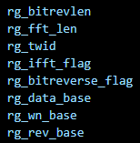

# MOCE_CFFT设计文档 #
### 算子功能说明
- 完成基4的FFT计算
- 支持点数可配【16，32，64，128，256，512，1024，2048，4096】
- 支持正、逆FFT计算
- 支持位反转

### C model说明
- 主函数：MOCE_cfft_q31
- 相关函数：
  - arm_radix4_butterfly_q31：点数为4的幂次时的fft运算
  - arm_radix4_butterfly_inverse_q31：点数为4的幂次时的fft逆运算
  - arm_cfft_radix4by2_q31：点数为4的幂次/2时的fft运算
  - arm_cfft_radix4by2_inverse_q31：点数为4的幂次/2时的fft逆运算
  - arm_bitreversal_32：位反转
- 运算参数：参考moc_engine_fft_support_func.c
  - twiddleCoef_xx_q31：xx点的旋转因子表
  - armBitRevIndexTable_fixed_xx：xx点的位反转索引表
### RTL说明
- 存储结构
  - 需要两块memory，分别存放数据【DATA_MEM】和参数【WN_MEM】；需要4个带地址的line buffer，均为16x32bit；
  - 两块memory均为单端口SRAM，读写位宽为32bit；
  - DATA_MEM存放待计算的数据，基地址可配；FFT计算完成后，数据会被按序写入原地址；
  - 数据和旋转因子的数据类型均为q31；
  - WN_MEM存放旋转因子和位反转索引表，基地址均可配；
  - 注意：memory和line buffer的真实尺寸和接口尚未确定，初步验证时建议和别的模块统一存储的行为级模型；
- 接口列表

| Signal Name      | Direction | Width | Description |
| ----------- | ----------- | ----------- | ----------- |
| rg_bitrevlen      | I       | 12 | 位反转索引表长度，和fftlen有对应关系，详见moc_engine_fft_support_func.c的define |
| rg_fft_len   | I        | 16 | FFT运算点数，支持16，32，...,4096 |
| rg_twid   | I        | 16 | 旋转因子步长，C model中只用到了0和1 |
| rg_ifft_flag   | I        | 1 | FFT逆运算标志，为1时执行逆运算 |
| rg_bitreverse_flag   | I        | 1 | FFT位反转标志，为1时对FFT运算结果进行位反转 |
| rg_data_base   | I        | ADDR_WIDTH | FFT数据在DATA_MEM中的基地址，要求低2bit为0 |
| rg_wn_base   | I        | ADDR_WIDTH | 旋转因子在WN_MEM中的基地址，要求低1bit为0|
| rg_rev_base   | I        | ADDR_WIDTH | 位反转表格在WN_MEM中的基地址，无低bit为0的要求|
| cfft_start   | I        | 1 | CFFT启动信号|
| cfft_done   | O        | 1 | CFFT完成信号|

`其余接口都是memory和line buffer接口，此处不做赘述

- 工作流程
1. 配置以下寄存器：

    
1. 发送cfft_start脉冲，启动CFFT计算；
2. 收到cfft_done表示计算完成，计算后数据存放在DATA_MEM的原地址；
