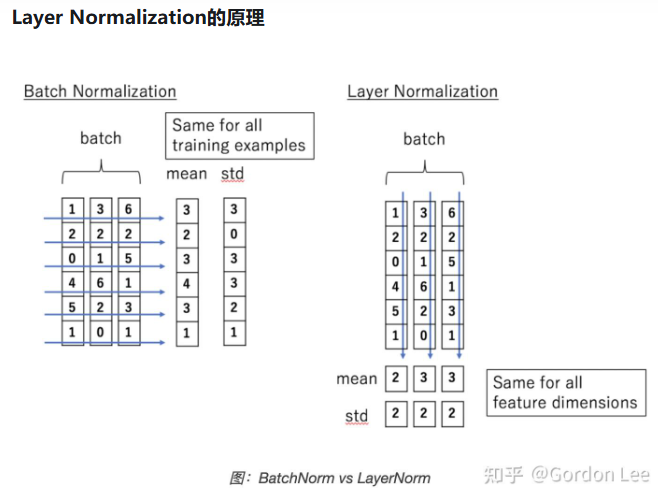
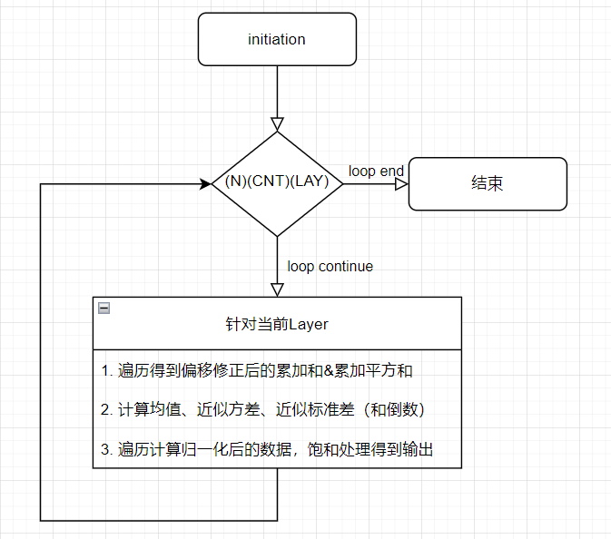
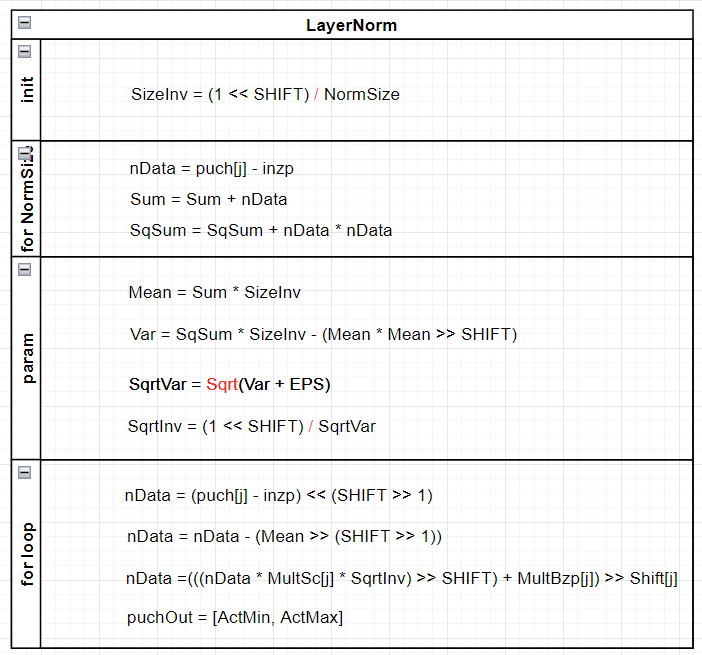
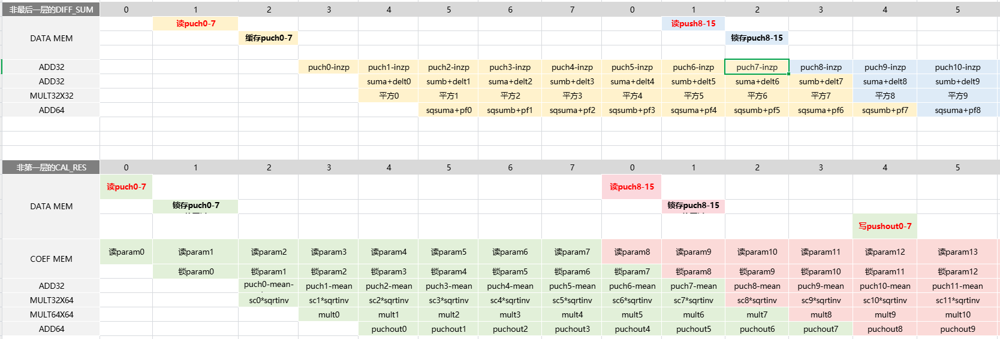

# Layernorm设计文档 #
### 算子原理说明

- Layernorm是基于batchnorm延申出的一种归一化方式；
- BN是对batch的维度去做归一化，也就是针对不同样本的同一特征做操作。LN是对hidden的维度去做归一化，也就是针对单个样本的不同特征做操作；
- BN就是在每个维度上统计所有样本的值，计算均值和方差；LN就是在每个样本上统计所有维度的值，计算均值和方差，所以BN在每个维度上分布是稳定的，LN是每个样本的分布是稳定的。
- $N×C×H×W$的输入图像，根据归一化长度$normsize$得到该组数据的累加和&平方和，计算得到均值、近似方差和标准差，重新遍历计算归一化值；
  - 数据排列方式：$(N)(C)(H)(W)$;
  - $normsize$为样本归一化长度;

### 模块SPEC
1. 支持归一化长度normsize可配，最大支持256（$N×C×H×W$可被$normsize$整除）
2. 输入输出数据带宽参数化为 $8 Byte$，即64bit
3. 参数数据带宽为 $17 Byte$
4. 支持输入图像基地址和输出图像基地址可配，基地址需要对齐数据读写带宽（即低3bit为000）
5. 支持参数基地址可配
6. 数据排列方式为$(N)(C)(H)(W)$，不同于其他层，可以视为一维向量输入/输出，无padding

### 硬模块微架构
- 存储结构
  - 需要两块memory bank，分别存放图像数据和参数值；
  - 两块memory均为单端口SRAM，图像数据memory读写位宽为64bit；读写基地址均可配；参数memory读写位宽为17Byte，读基地址可配；

- 数据流
  - 由于数据配列方式为$(N)(C)(H)(W)$，读一次内存可以得到8个数据（读1cycle），由于输入数据无padding，且$normsize$可被灵活配置，所以可能读到相邻的归一化向量的数据，因此需要`[normsize/8]或[normsize/8]+1`个周期完成一轮遍历。
  - 为了提高计算效率，增加并行度，引入pipeline，前一个normsize的数据的归一化计算和后一个normsize的数据的累加和&平方和计算同时进行。
    - 由于该架构理想情况（`normsize可被8整除`）下的两级pipeline完美匹配，pipeline无bubble，此时只需要`(NCHW/normsize+1)×(normsize/8)×T`个cycle做完layernorm；
    - 否则两级pipeline在某轮遍历时会有1T的mismatch；
  - 根据C model，Layernorm要实现的计算如下：
  - 
  - 
  - 硬件计算流程如下：
  - 

### 接口列表

| Signal Name      | Direction | Width | Description |
| ----------- | ----------- | ----------- | ----------- |
| rg_normsize  | I       | 32 | 归一化长度，支持1~256可配 |
| rg_inzp      | I       | 8 | 输入偏移量 |
| rg_outzp     | I       | 8 | 输出偏移量 |
| rg_actvale   | I       | 1 | 激活最小截断值选择，0：0，1：rg_outzp |
| rg_batch | I        | 8  | 数据批次 |
| rg_inh   | I        | 16 | 输入图像高度 |
| rg_inw   | I        | 16 | 输入图像宽度 |
| rg_inc   | I        | 16 | 输入图像通道数 |
| rg_outh  | I        | 16 | 输出图像高度 |
| rg_outw  | I        | 16 | 输出图像宽度 |
| rg_outc  | I        | 16 | 输出图像通道数 |
| rg_src_base   | I        | ADDR_WIDTH  | 源数据的基地址，要求低3bit为0 |
| rg_dest_base  | I        | ADDR_WIDTH  | 目的数据的基地址，要求低3bit为0|
| rg_coef_base  | I        | CADDR_WIDTH | 参数的基地址 |
| layernorm_start   | I        | 1 | layernorm启动信号|
| layernorm_done    | O        | 1 | layernorm完成信号|
| layernorm_fail    | O        | 1 | layernorm错误信号|

`其余接口都是memory接口，此处不做赘述

### 工作流程
1. 配置相关寄存器；
2. 发送layernorm_start脉冲，启动layernorm归一化；
3. 收到layernorm_done表示归一化完成，归一化数据存放同一块memory bank的地址中；
