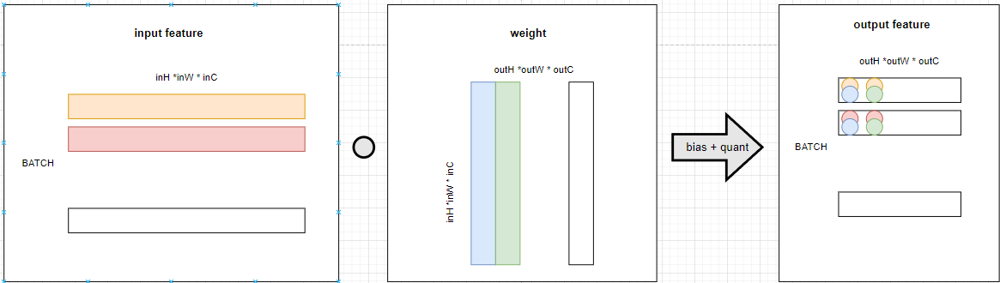

# nn_linear设计文档 #
### 算子原理说明

- nn_linear本质上是matmul，实现输入feature和权重的乘累加；
- $NHWC$的输入图像，展成$N×InFeaNum$，和被展成$InFeaNum×OutFeaNum$权重做矩阵乘和bias，然后经过量化得到$N×OutFeaNum$的输出图像；

### 模块SPEC
1. 输入数据格式为$uint8$，权重数据格式为$int8$，输出数据格式为$uint8$；
2. 输入输出带宽参数化为 $8 Byte$，即64bit
3. 支持输入/权重/输出图像基地址和输出图像基地址可配，基地址需要对齐数据读写带宽（即低3bit为000）
4. 数据排列方式为$(N)(H)(W)(C)$，其中$HWC$上需要padding成与读写带宽对齐（即无法整除8，则默认输入输出数据是padding到8的倍数）

### 硬模块微架构
- 存储结构
  - 为了达到较高的加速比，支持同时读写内存，因此需要三套memory接口，分别访问源数据、权重、量化参数和回写目的数据；
  - memory均为单端口SRAM，读写位宽为64bit；基地址均可配；

- 数据流
  - 由于数据配列方式为$(N)(H)(W)(C)$，读一次内存可以得到8个数据（读1cycle），再分别将该8个数据和8个权重做乘累加，中间结果暂存在Sum寄存器中，直到做完一整次乘累加，做完量化后写入对应的地址（写1cycle）。
  - 读写速率为：连读-间隔写。
  - 由于多个BATCH之间访问参数（包括weight和量化参数）的行为是一致的，因此可以通过复制多份memory接口和乘累加逻辑来实现并行；但开销是memory接口和前后级数据搬移；

### 接口列表

| Signal Name      | Direction | Width | Description |
| ----------- | ----------- | ----------- | ----------- |
| rg_batch | I        | 10  | 数据批次 |
| rg_infeat_num   | I        | 19 | 输入图像HWC |
| rg_outfeat_num  | I        | 19 | 输出图像HWC |
| rg_outzp   | I        | 8 | 输出clip的最小下限 |
| rg_actvalue   | I        | 1 | 输出clip下限是否使用rg_outzp，否则为0 |
| rg_in_mem_base   | I        | ADDR_WIDTH | 源数据的基地址，要求低3bit为0 |
| rg_out_mem_base  | I        | ADDR_WIDTH | 目的数据的基地址，要求低3bit为0|
| rg_weight_mem_base  | I     | ADDR_WIDTH | 权重数据的基地址，要求低3bit为0|
| rg_multsc/multbzp/multshift_mem_base  | I     | ADDR_WIDTH | 量化数据的基地址x3，要求低3bit为0|
| start  | I        | 1 | 启动信号|
| done   | O        | 1 | 完成信号|

`其余接口都是memory接口，此处不做赘述

### 工作流程
1. 配置相关寄存器；
2. 发送start脉冲，启动matmul计算；
3. 收到done表示上采样完成，计算数据存放另一块memory bank的地址中；
