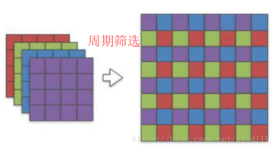
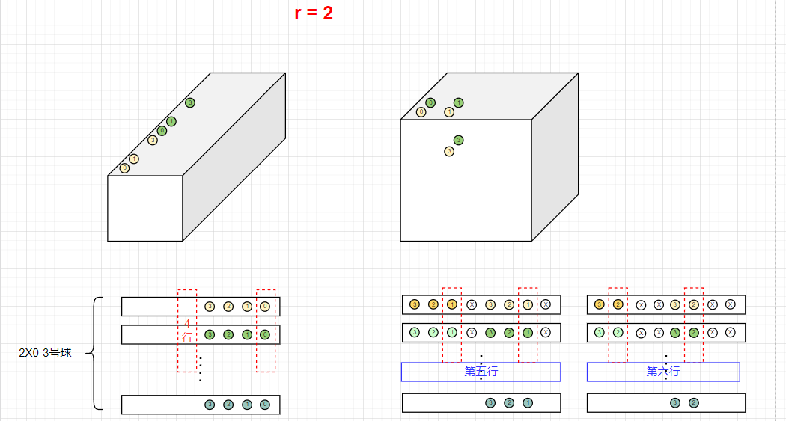
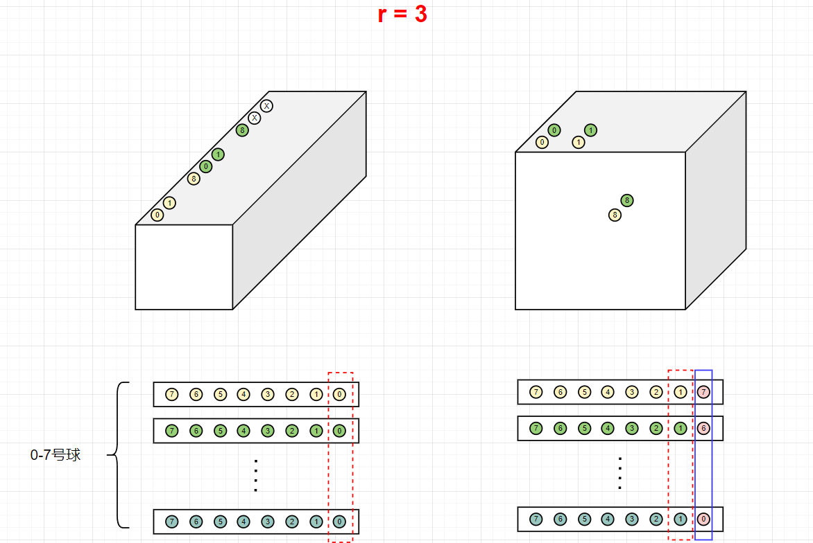
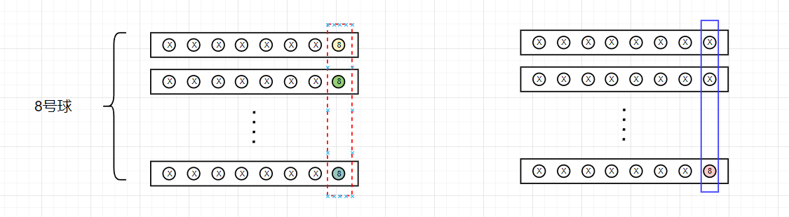
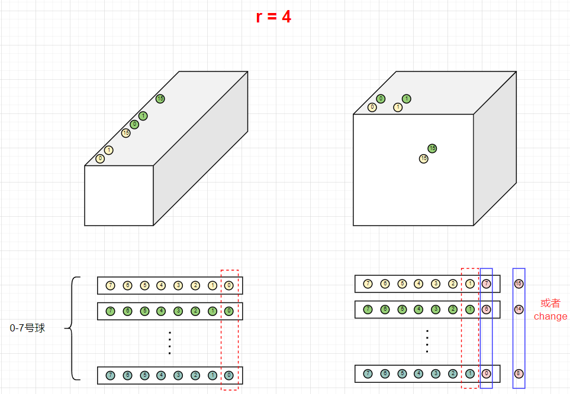

# PixelShuffle设计文档 #
### 算子原理说明

- pixelshuffle是上采样的一种方法，旨在将一个低分辨率图像转为高分辨率图像；
- $H×W$的低分辨率输入图像，一般会先经过卷积层，得到 $r^2×H×W$的图像，然后通过pixelshuffle做周期筛选得到 $r×H×r×W$的高分辨率输出图像；
  - 数据排列方式：$(N)(H)(W)(C)$ -> $(N)(rH)(rW)(C/r^2)$;
  - $r$为上采样因子;

### 模块SPEC
1. 支持上采样因子配置范围： $r=2, 3, 4$
2. 输入输出带宽参数化为 $8 Byte$，即64bit
3. 支持输入图像基地址和输出图像基地址可配，基地址需要对齐数据读写带宽（即低3bit为000）
4. 数据排列方式为$(N)(H)(W)(C)$，其中$C$通道方向上需要padding成与读写带宽对齐（即无法整除8，则默认输入输出数据是padding到8的倍数）

### 硬模块微架构
- 存储结构
  - 为了达到较高的加速比，支持同时读写内存，因此需要两块memory bank，分别存放源数据和目的数据；
  - 两块memory均为单端口SRAM，读写位宽为64bit；基地址均可配；

- 数据流
  - 由于数据配列方式为$(N)(H)(W)(C)$，读一次内存可以得到8个数据（读1cycle），再分别将该8个数据写入对应的地址（写8cycle）。此时读写速率严重不匹配，8个数据需要9个cycle。
  - 为了降低重复读写同一地址的数据，提高数据利用率，本模块根据pixshuffle的特性，读8次内存，得到8x8=64个数据，经过重排后，通过8次写内存，将8组数据完整得写入8个地址中。理想情况下，64个数据只需要16个cycle。
  - 为了进一步增加并行度，引入pipeline，前一笔64个数据的写操作和后一笔64个数据的读操作同时进行。由于该架构理想情况下的读写速率完美匹配，因此pipeline无bubble，此时64个数据只需要8个cycle。
  - 为了支持以上架构，模块内部需要一个容量为 $64Byte$的buffer来缓存待重排数据，重排完成后马上读出。为了支持pipeline结构，buffer的容量还应该double，但是本架构利用“纵横式”的数据流，不需要double buffer的容量即可实现pipeline。
  - 当读写带宽为 $8 Byte$时，$r$=3时，存在跨地址问题，因此满足重排条件的8个数据最差情况下需要跨地址读2次才能读/写。
  - $r=2$
    

  - $r=3$
    
    

  - $r=4$
    

### 接口列表

| Signal Name      | Direction | Width | Description |
| ----------- | ----------- | ----------- | ----------- |
| rg_rfactor      | I       | 3 | 上采样因子，只支持2，3，4 |
| rg_batch | I        | 8  | 数据批次 |
| rg_inh   | I        | 16 | 输入图像高度 |
| rg_inw   | I        | 16 | 输入图像宽度 |
| rg_inc   | I        | 16 | 输入图像通道数 |
| rg_outh  | I        | 16 | 输出图像高度 |
| rg_outw  | I        | 16 | 输出图像宽度 |
| rg_outc  | I        | 16 | 输出图像通道数 |
| rg_src_base   | I        | ADDR_WIDTH | 源数据的基地址，要求低3bit为0 |
| rg_dest_base  | I        | ADDR_WIDTH | 目的数据的基地址，要求低3bit为0|
| pixshff_start   | I        | 1 | pixelshuffle启动信号|
| pixshff_done   | O        | 1 | pixelshuffle完成信号|

`其余接口都是memory接口，此处不做赘述

### 工作流程
1. 配置相关寄存器；
2. 发送pixshff_start脉冲，启动上采样数据重排；
3. 收到pixshff_done表示上采样完成，重排后的数据存放另一块memory bank的地址中；
