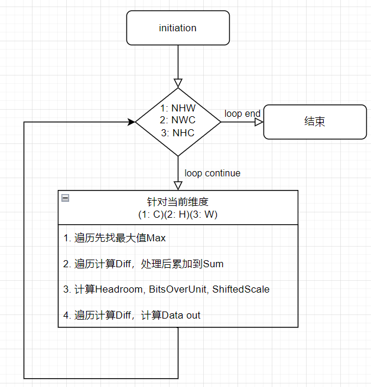
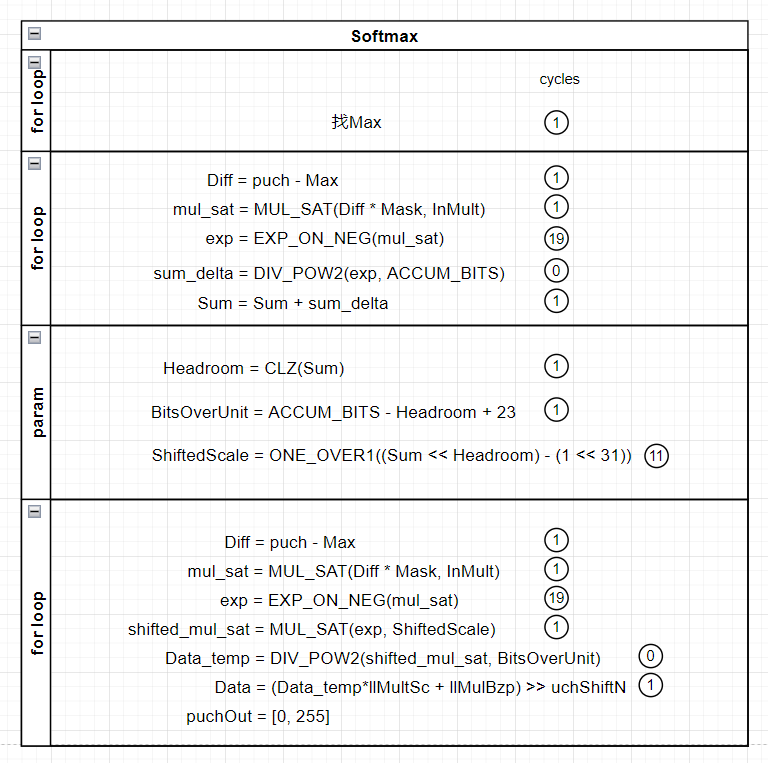

# Softmax设计文档 #
### 算子原理说明

- Softmax本质是一种激活函数，将一个数值向量归一化为一个概率分布向量，且各个概率之和为1；
- Softmax一般用来作为神经网络的最后一层，用于多分类问题的输出；
- $N×H×W×C$的输入图像，在$H/W/C$维度上进行归一化，得到$N×H×W×C$的输出图像；
  - 输入/输出数据排列方式：$(N)(H)(W)(C)$ ;
  - 归一化维度可配 ;

### 模块SPEC
1. 支持softmax归一化维度可配： $H/W/C$
2. 输入输出带宽参数化为 $8 Byte$，即64bit
3. 支持输入图像基地址和输出图像基地址可配，基地址需要对齐数据读写带宽（即低3bit为000）
4. 数据排列方式为$(N)(H)(W)(C)$，其中$C$通道方向上需要padding成与读写带宽对齐（即无法整除8，则默认输入输出数据是padding到8的倍数）

### 硬模块微架构
- 存储结构
  - 需要一块memory bank，存放源数据和目的数据；
  - memory为单端口SRAM，读写位宽为64bit；
  - 读写基地址可配（注意：支持原址写回，否则需要保证源数据和目的数据non-overlap）；

- 数据流
  - 由于数据配列方式为$(N)(H)(W)(C)$，读一次内存可以得到8个数据。
  - 当归一化维度为$C$时，
    - 连续读`[C/8]`次，除去padding的无效数据后，遍历得到MAX值；
    - 重新遍历$C$通道数据，根据C model计算出归一化参数$Headroom，BitsOverUnit，Shiftedscale$；
    - 再次遍历$C$通道数据，计算得归一化数据并写回memory；
  - 当归一化维度为$H或W$时，
    - 连续读`[H/8或者W/8]`次，每次并行处理8个不同通道的有效数据，同理经过3次遍历，分别得到MAX值、归一化参数，并将归一化计算值回写到memory；
  - 由于读写带宽为$8 Byte$，权衡性能和硬件资源后，设定计算并行度为8；
  - 根据C model，Softmax要实现的计算如下：
  - 
  - Softmax控制逻辑的的状态机为：
    
    `IDLE -> FIND_MAX  -> DIFF_SUM -> GET_SHIFT -> CAL_RES -> FIND_MAX -> ... -> CAL_RES -> DONE`

### 接口列表

| Signal Name      | Direction | Width | Description |
| ----------- | ----------- | ----------- | ----------- |
| rg_dim        | I        | 2  | 归一化维度，1:C, 2:H, 3:W |
| rg_llmulbzp   | I        | 64 | 量化偏差系数     |               
| rg_llmultsc   | I        | 64 | 量化乘系数       |               
| rg_llshift    | I        | 8  | 量化移位系数     |               
| rg_inmultsc   | I        | 32 | 输入数据乘系数   |             
| rg_inshift    | I        | 8  | 输入数据移位系数 |          
| rg_batch | I        | 8  | 数据批次 |
| rg_inh   | I        | 16 | 输入图像高度 |
| rg_inw   | I        | 16 | 输入图像宽度 |
| rg_inc   | I        | 16 | 输入图像通道数 |
| rg_outh  | I        | 16 | 输出图像高度 |
| rg_outw  | I        | 16 | 输出图像宽度 |
| rg_outc  | I        | 16 | 输出图像通道数 |
| rg_src_base   | I        | ADDR_WIDTH | 源数据的基地址，要求低3bit为0 |
| rg_dest_base  | I        | ADDR_WIDTH | 目的数据的基地址，要求低3bit为0|
| softmax_start  | I        | 1 | softmax启动信号|
| softmax_done   | O        | 1 | softmax完成信号|

`其余接口都是memory接口，此处不做赘述

### 工作流程
1. 配置相关寄存器；
2. 发送softmax_start脉冲，启动Softmax归一化；
3. 收到softmax_done表示上采样完成，归一化的数据存放同一块memory中；
