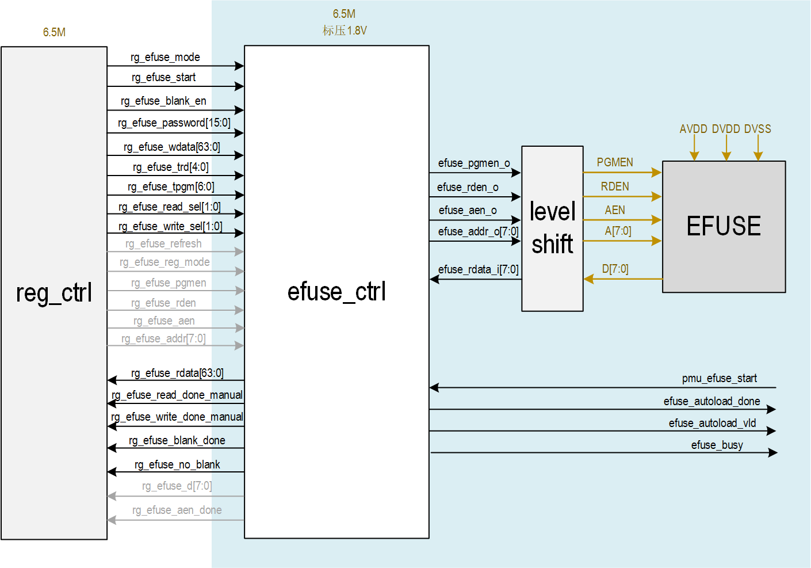
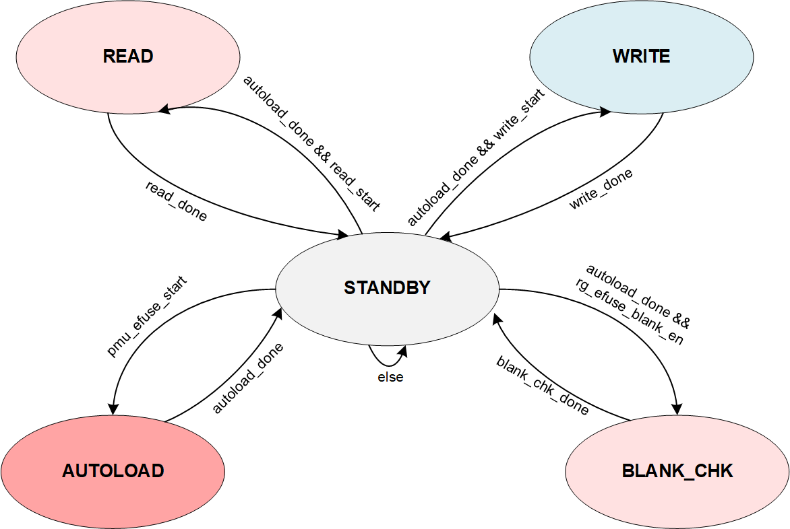
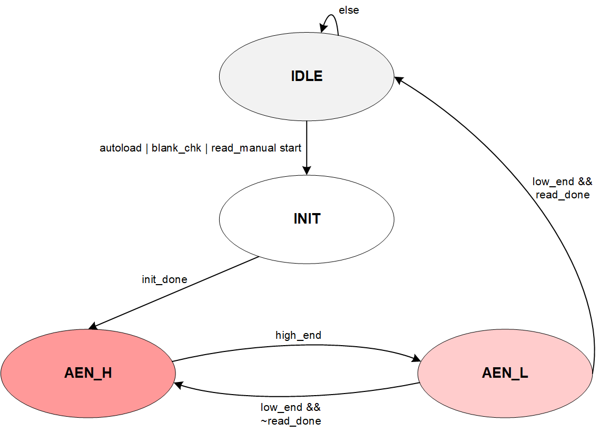
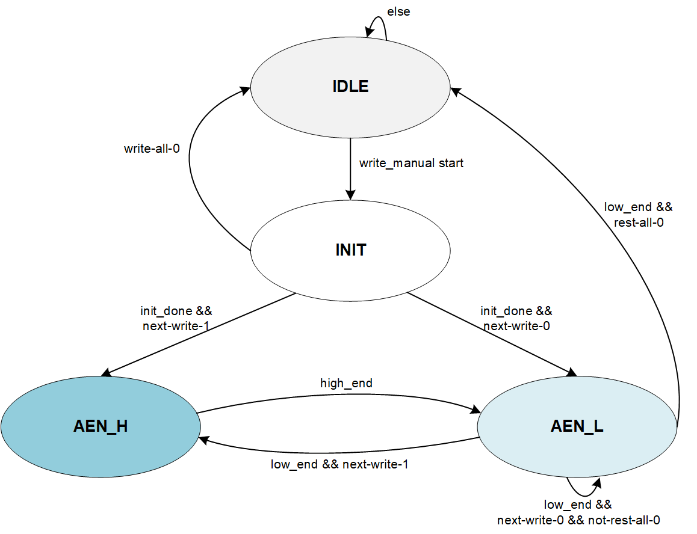

# ChelseaA efuse_ctrl 设计文档

#### 修订记录：

| 版本 |   日期   | 修改内容及理由 | 拟制人 |
| :--: | :------: | :------------: | :----: |
| V0.1 | 2024-5-4 |  完成初版设计  | 王雨非 |
|      |          |                |        |
|      |          |                |        |

## 1.模块概述

​	efuse_ctrl用于控制EFUSE器件在正常工作模式下的读写接口时序，本项目采用一颗256bit的EFUSE Macro IP（S018BCDEFUSE_PIPO256B4M），该EFUSE IP采用SMIC 0.18um工艺，工作在5V标准DVDD下，AVDD要求低于DVDD且在烧录操作时必须为高。该EFUSE IP有三种工作模式，分别是PGM、READ、Inactive mode，对应模式的引脚描述和时序详见datasheet。 	该EFUSE IP支持单次1bit的烧录操作和单次8bit的读操作，读操作的地址映射关系详见datasheet。 	该EFUSE IP的电学特性详见datasheet。

## 2. 功能描述

- 该模块工作在always-on domain的6.5M时钟下，该时钟受到pmu和rg_efuse_clk_en的gate。

- 该模块支持Autoload、硬件64bit读写、寄存器模式读写、空片检查操作：

  - Autoload：
    - 芯片刚上电完成后，PMU产生pmu_efuse_start脉冲，efuse_ctrl自动进入AUTOLOAD模式，将EFUSE IP中默认选中的64bit数据（根据片选寄存器rg_efuse_sel的默认值）读出并存入rg_efuse_rdata[63:0]，并拉高autoload_done。
    - 在上电后，完成autoload前，可以通过拉低rg_efuse_clk_en来强行跳过autoload；之后拉高ckgt使能仍然能对efuse读写；
    - 为了防止加载空片信息到寄存器，导致芯片挂死，因此在efuse中某1bit使能，才回把autoload的信息load到regfile；
    
  - 硬件64bit连续写：
    - 系统可以将efuse配置为64bit连续写模式。系统将待写的64bit存入rg_efuse_wdata[63:0]，并配置rg_efuse_mode为1，配置片选寄存器rg_efuse_sel，启动rg_efuse_start后，efuse_ctrl会逐位判断写数据是否为0，为0则跳过不烧录，为1才进行烧录操作。如果64bit全为0，则不会开启写操作。当64bit数据烧录完成后返回1bit的rg_efuse_write_manual_done信号。

    - 写操作支持写保护寄存器，仅当rg_efuse_password配置为0x66AA时，才能进行写操作，否则只能进行读操作。

    - 支持写操作AEN高电平时间可配。

  - 硬件64bit连续读：
    - 系统可以将efuse配置为64bit连续读模式。系统配置rg_efuse_mode为0，配置片选寄存器rg_efuse_sel，启动rg_efuse_start后，efuse_ctrl会逐字节读出EFUSE IP中的数据，并存放到rg_efuse_rdata[63:0]中，并返回1bit的rg_efuse_read_manual_done信号。
  
    - 支持读操作AEN高电平时间可配。
  
  - 寄存器模式写：
    - 除了PGM模式下的AEN信号由硬件控制外，其余接口信号都完全接受寄存器控制（由于SPI/IIC配置无法实现datasheet中要求的9~11us的Tpgm时间），当需要对相应地址烧录1时，用户对rg_efuse_refresh=W1C时，硬件会自动产生一个符合rg_efuse_tpgm配置的高电平AEN信号。

  - 寄存器模式读：
    - 接口信号全都完全收到寄存器的控制，用户在读操作后合适的时间节点可以读出EFUSE返回的8bit数据。

  - 空片检查：
    - 用户开启空片检查使能后，efuse_ctrl才会启动空片检查功能，检查EFUSE IP内256bit数据是否全为0，如果全为0，回写rg_efuse_no_blank为0，表示该EFUSE为空片，否则写1；完成空片检查后，返回1bit的rg_efuse_blank_done信号。
  

## 3. 整体设计

### 3.1 整体架构

### 3.2 顶层接口列表

| signal name | direction | width | comment |
| ---- | ----- |---| ---- |
| clk | input | 1 | 6.5M |
| rst_n | input | 1 | |
| scan_mode | input | 1 | |
| pmu_efuse_start | input | 1 | 上电完成后，pmu给出efuse可以开始autoload流程的使能信号 |
| ad_pd_5v | input | 1 | Level shifter相关 |
| rg_efuse_mode | input | 1 | efuse控制模式，0：多bit读，1：多bit写 |
| rg_efuse_start | input | 1 | 硬件读写efuse启动信号，WC |
| rg_efuse_refresh | input | 1 | 纯寄存器模式下的刷新信号，WC |
| rg_efuse_blank_en | input | 1 | 空片检测使能，WC |
| rg_efuse_password | input | 16 | 写保护，为0x66AA时才能进行硬件写 |
| rg_efuse_wdata | input | 64 | 64bit硬件写模式的写数据 |
| rg_efuse_trd | input | 5 | 读操作AEN高电平时间，单位为cycle，配置范围{7~31}，Trd=(rg+2)xT |
| rg_efuse_tpgm | input | 4 | 写操作AEN高电平时间，单位为cycle，配置范围{0~12}，Tpgm=(rg+59)xT |
| rg_efuse_reg_mode | input | 1 | 是否由寄存器直接控制efuse读写，高有效 |
| rg_efuse_sel | input | 2 | 硬件读写256bit中哪64bit |
| rg_efuse_pgmen             | input     | 1     | 纯寄存器下PGMEN                                              |
| rg_efuse_rden              | input     | 1     | 纯寄存器下RDEN                                               |
| rg_efuse_aen               | input     | 1     | 纯寄存器下AEN（仅读操作有效）                                |
| rg_efuse_addr              | input     | 8     | 纯寄存器下读写地址                                           |
| rg_efuse_d                 | output    | 8     | 纯寄存器下EFUSE返回的读数据                                 |
| rg_efuse_rdata             | output    | 64    | 64bit硬件读模式的数据                                        |
| rg_efuse_read_done_manual  | output    | 1     | 64bit硬件读模式完成，RO                                      |
| rg_efuse_write_done_manual | output    | 1     | 64bit硬件写模式完成，RO                                      |
| rg_efuse_blank_done | output | 1 | 空片检查模式完成，RO |
| rg_efuse_no_blank          | output    | 1     | efuse是否为空片，1：非空                                     |
| rg_efuse_aen_done          | output    | 1     | 纯寄存器模式写操作写，完成一次写返回done                     |
| efuse_autoload_done        | output    | 1     | 上电后efuse完成autoload标志，电平，有时钟就会一定能拉高      |
| efuse_autoload_vld         | output    | 1     | 上电后efuse完成autoload的有效标志，脉冲，控制reg_ctrl刷新对应autoload的寄存器 |
| efuse_busy                 | output    | 1     | efuse处于读写状态标志，1：忙碌                               |

## 4. 详细设计

### 4.1 efuse_rw_ctrl模块设计

​	本项目的设计需求中，硬件需要实现上电后自动Autoload、支持连续64bit读写、支持空片检查的时序控制，因此efuse_ctrl顶层的控制状态分为如下：STANDBY、AUTOLOAD、READ、WRITE和BLANK_CHK。可以看到，各个功能模式之间都被STANBY模式隔离开，保证了读写之间有足够的时间间隔，且保证了产生的PGMEN和RDEN不会进入两个都为HIGH的禁用模式。 	其中AUTOLOAD是芯片上电复位后，收到PMU发出的pmu_efuse_start脉冲后，efuse_ctrl从STANDBY进入AUTOLOAD，直到加载完成；各个功能相互独立，无法同时进行。

### 4.2 efuse_rw_timing模块设计

​	由于读写控制逻辑类似，只在一些状态跳转条件上有区别，因此为了减小efuse_ctrl电路的面积，本设计复用了读写时序控制状态机，如下。

#### 4.2.1 READ timing FSM

#### 4.2.2 WRITE timing FSM

### 4.3 efuse_aen_gen模块设计

​	当电路处于纯寄存器写操作时，由于ChelseaA中AEN的高电平脉宽在burning写时必须满足9~11us，该时序无法通过SPI/IIC配置寄存器产生，因此该信号通过硬件自己产生(即efuse_aen_gen模块)。 	该模块旨在当rg_efuse_refresh W1C时，产生一个符合rg_efuse_tpgm配置的脉宽的高电平信号，用作寄存器写操作下的AEN信号。(在寄存器读模式下该子模块不工作)。

### 4.4 efuse_mux模块设计

​	该子模块用于根据硬件读写状态和寄存器读写模式，选择对应的接口信号送到EFUSE。

## 5. 工作流程

#### 5.1 上电Autoload流程

1. 上电复位时，信号全初始化到Inactive状态；
2. 复位后，PMU产生pmu_efuse_start，此时EFUSE进入autoload流程；
   - is_autoload拉高，直到autoload结束
   - 复位释放后efuse_busy拉高，直到autoload结束
   - 产生内部read_start
3. 模块按照时序产生EFUSE控制信号给器件，开始autoload，读出根据rg_efuse_sel默认值选中的64-bit数据，收到read_done后数据加载到efuse_autoload_data寄存器；
4. 当EFUSE中数据load完后，产生efuse_load_vld脉冲，给reg_ctrl更新相关寄存器，并拉高efuse_autoload_done标志；
5. Autoload完后信号都恢复到Inactive状态；

#### 5.2 硬件写流程(64bit)

- 写操作对电压有要求，上下电时需要保证电压满足datasheet要求

1. 上电后，用户配置写保护寄存器rg_efuse_password（0x66AA）；配置操作模式：rg_efuse_mode=1；
2. 配置要写入的位置和64bit数据：rg_efuse_sel、rg_efuse_wr_data；
3. 启动写操作：rg_efuse_start（W1C）；
4. 查询rg_efuse_write_done拉高后表示64bit写操作完成；
5. 如果继续burn，重复<2-4>；
6. burn结束后所有信号恢复Inactive状态；

#### 5.3 硬件读流程(64bit)

1. 上电后，配置读操作模式：rg_efuse_mode=0；
2. 配置要读出数据的位置：rg_efuse_sel；
3. 启动读操作：rg_efuse_start（W1C）；
4. 查询rg_efuse_read_done拉高后表示64bit读操作完成，获得64bit读数据rg_efuse_rd_data；
5. 如果继续读，重复<2-4>；
6. 读结束后所有信号恢复Inactive状态；

#### 5.4 寄存器下的写操作

- 即所有PGMEN/RDEN/AEN/A[7:0]都直接用寄存器控制，要写入的数据为1时AEN才会拉高；
- 由于ChelseaA中AEN的高电平脉宽在burning写时必须满足9~11us，该时序无法通过SPI/IIC配置寄存器产生，因此该信号通过硬件自己产生(即efuse_aen_gen模块)
- 写操作对电压有要求，上下电时需要保证电压满足datasheet要求

1. 上电后，配置寄存器操作模式：rg_efuse_reg_mode=1；
2. 配置寄存器rg_efuse_pgmen=1（需要保证此前rg_efuse_rden=0）
3. 配置寄存器rg_efuse_addr[7:0]为所需burning的地址（即要写1的地址）
4. 配置寄存器rg_efuse_refresh=W1C，此时硬件自动产生一个和rg_efuse_tpgm对应脉宽的AEN电平信号，送给EFUSE IP；（其余几个控制信号都是直接根据寄存器配置得到，无需硬件产生）
5. 如果要继续写操作，重复<3-4>；如果无需继续写入，配置rg_efuse_pgmen=0（配置保证rg_efuse_rden=0），结束写操作，回到Inactive状态；
6. 配置rg_efuse_reg_mode=0，退出寄存器模式；

#### 5.5 寄存器下的读操作

- 即所有PGMEN/RDEN/AEN/A[7:0]都直接用寄存器控制，读出的D[7:0]也直接送给RO寄存器；

1. 上电后，配置寄存器操作模式：rg_efuse_reg_mode=1；
2. 配置寄存器rg_efuse_pgmen=1（配置保证rg_efuse_rden=0）
3. 配置寄存器rg_efuse_addr[7:0]为要读数据的地址（地址仅低5位有效）
4. 配置寄存器rg_efuse_aen=1，间隔合适的时间后（保证AEN高电平脉宽满足>Trd），配置寄存器rg_efuse_aen=0（此时efuse_aen_gen不工作，rg_efuse_refresh无效）
5. 等待TSQ时间后，读取数据输出到rg_efuse_rdata；
6. 如要读取下一个8bit，重复<3-5>；如果无需读取，配置rg_efuse_pgmen=0，（配置保证rg_efuse_rden=0），结束读操作，回到Inactive状态；
7. 配置rg_efuse_reg_mode=0，退出寄存器模式；

#### 5.6 空片检查

- 用户开启空片检查使能后，efuse_ctrl才会启动空片检查功能，检查EFUSE IP内部256bit数据是否全为0，如果全为0，回写rg_efuse_no_blank为0，表示该EFUSE为空片，否则写1；

1. 上电后，如果要进行空片检查，配置寄存器rg_efuse_blank_en=WC；
2. 查询rg_efuse_blank_done拉高后表示空片检查完成，获得空片检查结果rg_efuse_no_blank；【0504新增信号：空片检查完成信号rg_efuse_blank_done】

## 6. 软件使用说明与约束

### 6.1 寄存器列表

| signal name                | direction | width | comment                                                      |
| -------------------------- | --------- | ----- | ------------------------------------------------------------ |
| rg_efuse_mode              | input     | 1     | efuse控制模式，0：多bit读，1：多bit写                        |
| rg_efuse_start             | input     | 1     | 硬件读写efuse启动信号，WC                                    |
| rg_efuse_refresh           | input     | 1     | 寄存器模式下的刷新信号，WC                                   |
| rg_efuse_blank_en          | input     | 1     | 空片检测使能，WC                                             |
| rg_efuse_password          | input     | 16    | 写保护，为0x66AA时才能进行硬件写                             |
| rg_efuse_wdata             | input     | 64    | 64bit硬件写模式的写数据                                      |
| rg_efuse_trd               | input     | 5     | 读操作AEN高电平时间，单位为cycle，配置范围{7~31}，Trd=(rg+2)xT |
| rg_efuse_tpgm              | input     | 7→4   | 写操作AEN高电平时间，单位为cycle，配置范围{0~12}，Tpgm=(rg+59)xT |
| rg_efuse_reg_mode          | input     | 1     | 是否由寄存器直接控制efuse读写，高有效                        |
| rg_efuse_sel               | input     | 2     | 硬件读写256bit中哪64bit                                      |
| rg_efuse_pgmen             | input     | 1     | 纯寄存器下PGMEN                                              |
| rg_efuse_rden              | input     | 1     | 纯寄存器下RDEN                                               |
| rg_efuse_aen               | input     | 1     | 纯寄存器下AEN（仅读操作有效）                                |
| rg_efuse_addr              | input     | 8     | 纯寄存器下读写地址                                           |
| rg_efuse_d                 | output    | 8     | 纯寄存器下EFUSE返回的读数据                                  |
| rg_efuse_rdata             | output    | 64    | 64bit硬件读模式的数据                                        |
| rg_efuse_read_done_manual  | output    | 1     | 64bit硬件读模式完成，RO                                      |
| rg_efuse_write_done_manual | output    | 1     | 64bit硬件写模式完成，RO                                      |
| rg_efuse_blank_done        | output    | 1     | 空片检查模式完成                                             |
| rg_efuse_no_blank          | output    | 1     | efuse是否为空片，1：非空                                     |
| rg_efuse_aen_done          | output    | 1     | 纯寄存器模式写操作写，完成一次写返回done                     |
| efuse_autoload_done        | output    | 1     | 上电后efuse完成autoload标志，RO                              |
| efuse_busy                 | output    | 1     | efuse处于读写状态标志，1：忙碌，RO                           |

### 6.2 操作约束

- 用户配置寄存器的过程，需要根据《5.工作流程》中描述的进行；

### 6.3 验证点列表

- 电路层级上
  - [ ] 上下电and读写时DVDD/AVDD/DVSS的供电状态；
  - [ ] Level Shifter的工作
- RTL功能层级上
  - [ ] 上电后autoload功能是否正确
  - [ ] 硬件连续读写功能是否正确
  - [ ] 寄存器读写功能是否正确
  - [ ] 空片检查功能是否正常
  - [ ] 读操作、写操作的时序是否符合EFUSE datasheet要求
  - [ ] 读写操作的切换的时序是否满足EFUSE datasheet要求
  - [ ] 时序的配置是否符合本datasheet描述
  - [ ] efuse中存储的256bit数据mapping是否符合产测&DE提供的excel表格

### notion
- efuse中存储的信息：
  - 芯片信息版本、功能disable/select、模拟偏置值(clock,temp等)；
- efuse操作会消耗时间和功耗，所以autoload的bit数和blank check非必要可以缩减or使能；
- efuse涉及器件IP，会有IP和LEVEL SHIFTER参与，前端无需关注VDD/VSS，仿真时只需要tie个能工作的值(by define)，后端会完成连接；
- efuse的IP中有timing check，因此仿真时注意option；
- efuse load的寄存器，可能有地址要求，注意需要满足；
- 纯寄存器读写时，尽量把有先后时序要求的寄存器放在不同field中，免得用户同时配置同时生效；或者写明先后配置的要求；