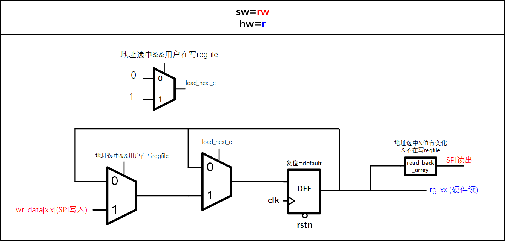
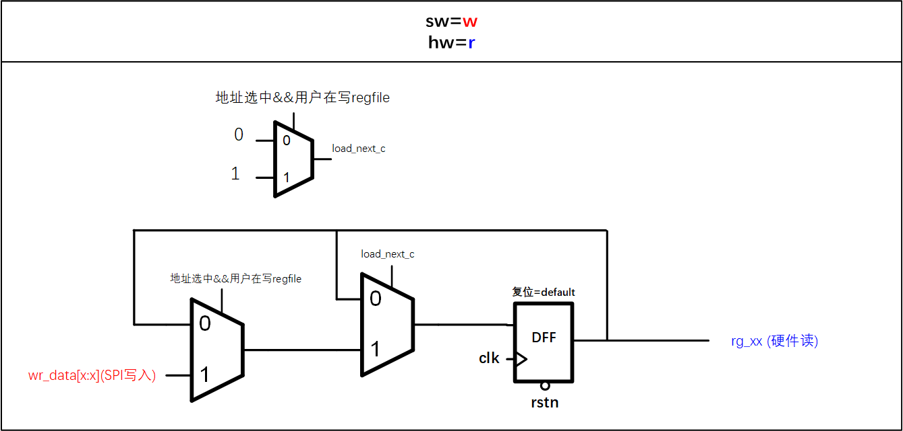
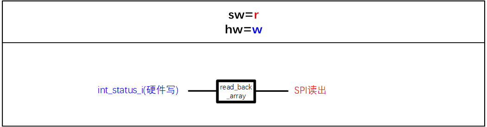
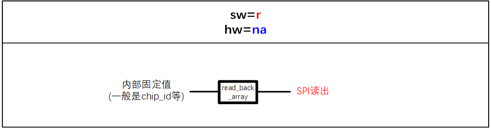
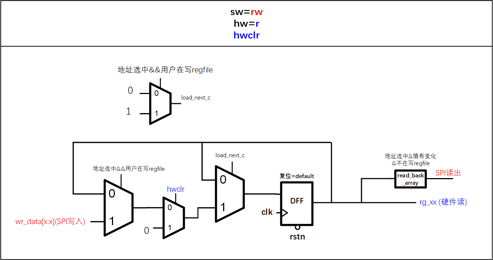

# REG 
- 寄存器堆，根据不同需求，通过软硬件读写来配置电路、传递信息等；
- 通用的reg_ctrl模块的时钟一般会用系统时钟（例如clk_sys），用户进行软件读写时，SPI送入的reg数据和控制信号会同步到reg_ctrl的clock domain，再控制内部寄存器；
- 假设clk_sys频率=K，那么SPI最高读写速率可以达到16K(此处默认spi读写位宽为16bit)。
  - 当reg_ctrl使用的clk_sys频率较低时，会影响SPI的工作速率，比如Cardiff C中系统最高128K，但是SPI定的是16M，双方无法匹配，因此考虑采用SPI作为regfile和FIFO的读写时钟；但是Chelsea A中系统会提供一个6.5M的时钟源，双方速率较为匹配，因此regfile和FIFO可以直接使用系统时钟。
  - 对于采用非系统时钟作为reg和FIFO时钟时：(Cardiff C)
    - 采用SPI时钟作为regfile和FIFO的读写时钟时，需要注意spi的极性配置，当rg_cpha^rg_cpol为0时，选择spi_sck，否则选择spi_sck_inv作为reg_ctrl的读写时钟；
    - 对于FIFO，用户访问时采用SPI时钟读写，非用户访问时要切换到clk_sys(此时没有spi时钟)
    - 对于regfile，reg直接使用SPI时钟读写，对于需要硬件回写的寄存器需要手动处理(此时没有spi时钟)；对于此类IP写寄存器：
      - alon IP回写：可以放在alon IP内部处理（使用clk_sys），部分需要swclr的，同步spi域的swclr到clk_sys后处理；
      - shut IP回写：都需要放到alon的reg_manual中处理（使用clk_sys），部分需要swclr或swtrigger的，同步spi域的sw信号到clk_sys后处理；
      - IP回写寄存器可能存在“SPI读，IP回写”冲突，因此建议这类寄存器在IP写入时增加一个flag，告知用户此时该寄存器在进行硬件IP写回，有亚稳态产生读错误风险，再读一次；(但CardiffC好像没加，为了面积？)

- ## 寄存器属性要素
  
  | 寄存器要素 | 描述 |
  | ---- | ----- |
  |地址|按地址寻址|
  |位宽|决定了在绝对地址中的offset|
  |name|寄存器名称，一般rg/ro_xxx开头|
  |属性|软件&硬件r/w/rw/ro/w1c等|
  |default值|复位时的默认值，一般配置为使电路可以正常工作的值|
  |

- ## sw 软件属性
  - sw = wr
    - 一般寄存器都是软件可读可写，可写的目的是：用户配置；可读的目的是用户可以回读寄存器，for检测或者啥的；
  - sw = w
    - 比如CardiffC中，有些reg_top只产生swmod，而寄存器本体在reg_manual中手动写的，相当于用户写的是一个pulse，而真正需要回读的寄存器和写入的不一致，回读检查一致性的意义不大，因此不需要用户可读；
  - sw = r
    - 只读，一般是一些记录性的寄存器，或者硬件写入的寄存器（比如int_status），用户没有写入权限；
  - swclr
    - 软件写1清零，一般应用于rg_int_clr、triggle等寄存器；但是CardiffC中由于spi时钟时有时无，所以改成了sw=w,hw=na,swmod=true；此时会产生一个pulse的swmod，该pulse和reg_data[15:0]按位与后得到对应的W1C寄存器；
    - 当设置成onwrite=woclr时，即对于该地址所有bit的寄存器都会有W1C操作；(和swmod区分开来)
- ## hw 硬件属性
  - hw = wr
    - 对于一些芯片内部产生或会对其进行修改的寄存器，且硬件可读的（这里注意因为我们的修改会放到reg_manual模块，因此对于硬件连接直接从reg_manual拉出即可，不需要重新塞进regfile，因此会写成hw=r-->regmanual-->硬件）；
  - hw = w
    - 对于一些芯片内部产生的需要回写的寄存器，比如int_status，比如有些eufse autoload的寄存器……
  - hw = r
    - 大多数寄存器都是软件读写，硬件只读，用于配置功能和数据
  - hw = na
    - 硬件没有权限做操作，电路内部是wire直连；比如analog_chip_id等；
  - hwclr
    - 硬件写1清，一般配合着hw=xx使用
    - CardiffC中部分寄存器收到硬件产生的rx_reset pulse复位，因此属于硬件写1清，hw=r;hwclr;

- ## 寄存器reg_top电路示例（Cardiff C）
generated by soctool script








- ## 手动寄存器reg_manual
手动目的：详见文档开头描述

处理方式：
  - alon IP回写：可以放在alon IP内部处理（使用clk_sys），部
分需要swclr的，同步spi域的swclr到clk_sys后处理；
  - shut IP回写：需要放到alon的reg_manual中处理（使用
clk_sys），部分需要swclr或swtrigger的，同步spi域的sw信号
到clk_sys后处理；
  - 这两部分寄存器的spi时钟，都应该为rg_cpha^rg_cpol为0时，选择spi_sck，否则选择spi_sck_inv；因为sck随时可能没有，如果固定使用posedge，一方面不符合极性，另一方面所要用到的sck posedge可能没了；

- ## 寄存器类型
  - sw = rw; hw = r;
    绝大多数寄存器的类型；用户可见&可操作，硬件内部会用到，但不可改变；
  - sw = r; hw = w;
    用户只读寄存器；硬件内部产生；
    比如int_status；比如efuse load的寄存器chip_name/version(此时另外产生要load的值)；比如analog给的id(hw=w等效直接assign)；等
    ```无法通过we=true来赋值，因为sw=r不会生成DFF，不支持```
    ```hw = w 本质上是把硬件生成的值assign给reg```
  - sw = rw; hw = w; we = true;
    用户可见&可配置；硬件内部可改变（硬件内部在we为高时，可以改变）；
  - sw = rw; hw = w;
    ```不合理的写法，因为hw=w本质是assign，导致sw的写操作只能有效1个时钟周期，马上会被hw覆盖；```
    ```此时如果hw=rw，且内部else reghw<=reg_hw_i;此时硬件内部会有DFF产生(奇数个)；此时一旦存在两次以上不同值的写操作，就会触发该写法形成的偶数个DFF的反馈环，在两个值之间来回跳变```
  - sw = r; hw = na;
    用户只读；硬件写死；
    不支持任何改写，比如芯片版本号等；
  - onwrite = woset/woclr;
    软件写1置位/写1清零；
    注意区分，此处指的是，用户层面对寄存器写1后，寄存器内部置位or清零；此处的写1并不会改变寄存器内部为1；
  - onread = rclr/rset;
    软件读清/读置位；
    但凡访问该寄存器地址，都会在读出寄存器值之后，清零or
    置位该寄存器；
    注意和写清/置的区别；（GOODIX的SPI通讯中，读清只需要1个cmd，写清要2个cmd长度）
  - swmod = true；// singlepulse
    脉冲寄存器；即对寄存器写1，会产生一个一拍的正脉冲；
    注意区分和W1C寄存器的区别，类似但不一样；
    swmod适用于sck域的regfile，因为sck可能随时消失，无法拉低pulse，所以swmod自己会拉低，而singlepulse不会；
  - hwclr/hwset
    硬件写1清/置位；
    硬件内部自己产生信号，用于清除or置位寄存器；
