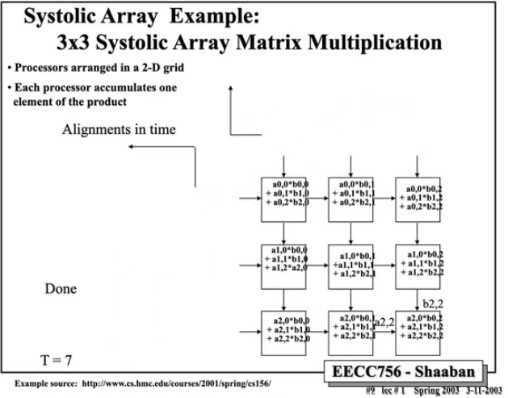
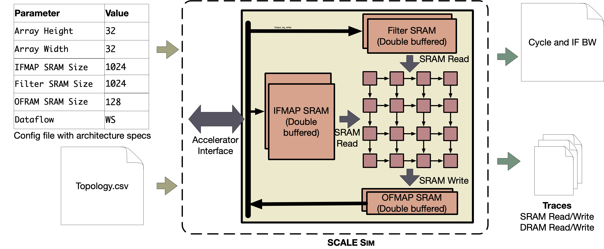
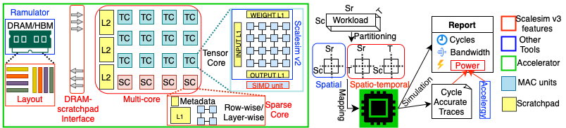

# AI加速文档 #
## 常用网络/算子
### 常用网络
- CNN
- Transformer
### 常用算子
- GEMM/MatMul（绝对核心）

    Linear/FC、1x1 Conv、Attention 的 QKV/投影

    变种：batched GEMM、grouped GEMM、block-sparse GEMM

- 卷积类

    Conv2D（KxK）、Depthwise Conv、Group Conv、Deconv/Transposed Conv

    Winograd / FFT（有时用在大核或特定场景）

- Attention 相关

    QK^T、Softmax、(Softmax·V)

    LayerNorm/RMSNorm

    KV Cache 读写（LLM 推理的关键瓶颈之一）

- 逐元素与归约

    Activation：ReLU/GELU/SiLU(Swish)、Tanh

    Eltwise：Add/Mul、BiasAdd

    Reduce：Sum/Max、Mean/Variance（Norm、Pool）

    Pool：MaxPool/AvgPool

- 数据重排/内存相关（经常是性能瓶颈）

    Transpose、Reshape、Concat/Split、Gather/Scatter

    Im2col/col2im（显式或隐式）

    Padding、Layout 转换（NCHW↔NHWC）

- 量化推理常见算子

    int8/int4 GEMM、Scale/Shift、Requantize、Clamp/Saturate

    Dequant/Quant（部分芯片做融合）

## 常用架构
- Systolic Array / 矩阵阵列（最主流NPU风格）

    代表：TPU 风格、NVDLA风格、很多 NPU 的 MAC 阵列、NVDLA

    优点：对 GEMM/Conv 映射简单、能量效率高、易扩展

    关键设计点：tile/流水、数据流（Output-stationary / Weight-stationary / Row-stationary）、片上 SRAM 容量与带宽

- SIMD/Vector + Tensor Core（GPU 风格）

    代表：GPU SM + Tensor Cores、部分可编程 AI Core

    优点：通用性强，算子覆盖广（尤其 attention + 各类 elementwise）

    缺点：能效通常低于专用 systolic（但生态最好）

- Spatial Dataflow / CGRA 类（介于可编程与专用之间）

    代表：可重构阵列、数据流图映射执行

    优点：适配多算子 pipeline、可做算子融合

    难点：编译映射复杂、时序/资源调度难

- 以存储为中心：Near-/In-Memory Compute（CIM）

    面向：大规模 GEMM/embedding（带宽瓶颈）

    常见：HBM-PIM、SRAM CIM、RRAM CIM（模拟/混合信号）

    优点：大幅降低数据搬运

    难点：精度/良率/一致性、编程模型、通用性

### TPU脉动阵列

- 本质上是完成`矩阵乘`计算；
- 需要提前将Conv等算子mapping成GEMM的形式（或者硬件在取数的时候自动mapping）；
- TPU阵列一般外接双重缓冲的InFea/Weight/OutFea buffer，通过ping-pong的方式减少读开销；
  - 矩阵A按照顺序`自左向右斜坡式`传入，矩阵B按照顺序`自上向下斜坡式`传入；
  - 每个PE中自带MAC单元，完成相乘和累加，得到psum；
  - 满转后对应PE中会得到结果，一般会在右侧/底部收集计算结果（PE结果直接bypass到收集网络中）;
  - 满转过后会在缺位补零，直到排空，完成所有计算；
  - 假设TPU阵列size为`M × N`，那么阵列排满并满转时，每周期最多能收集到`min(M,N)`个计算结果；
- Array Size决定了tile的切片尺寸；根据OutFeature Size来决定tile的切片方式；
  - 假设TPU阵列为3×3， GEMM的InFeaSize为4×5，WeightSize为5×6，那么（不考虑padding，strip=1）OutFeaSize为4×6；为了划分到TPU阵列中，会根据OutFeaSize划分出4个tile，分别为3×3、3×3、1×3、1×3，其中1×3会通过补0填充到3×3；此时使用率会有所降低；

### NVDLA MAC Array
PK & PC并行

### SIMD + Tensor core

## 常用架构模拟器
### TimeLoop + Acc

### Scale-Sim
- 参考资料：
  - https://mq-group.github.io/Hands_On/tools/simulator_details/scalesim_detailed/
  - https://github.com/scalesim-project/SCALE-Sim

- 该仿真器基于TPU阵列，用于评估`单层映射/单层数据流`；
- Scale-Sim核心是：给定一层（conv/GEMM），在一个固定数据流（WS/OS/RS）和固定阵列/带宽/片上SRAM 下，算这层的 mapping、访存、stall、util；
- 不支持streaming pipeline（即上层->下层不经过完整的RAM，通过一些缓存后直接下发）；这种更关注编译器和算子的调度，复杂度较高；
- v2中的tensor core：
  
- v3升级版：
  
