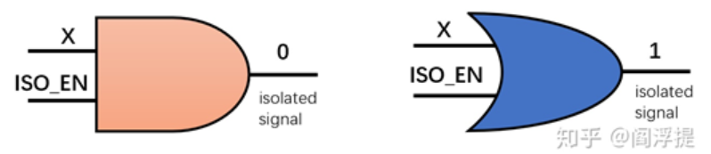

# 低功耗技术总结 #
## 电源门控（Power Gate）
对于有低功耗需求的design，将电路分为always on domain和shut down domain，在SLEEP模式下，shut domain会掉电，alon domain常开；对于长期处于SLEEP模式下的产品，该LP策略可以有效降低功耗。（比如血糖监测、手环等传感器产品）

以Cardiff C为例，划分到alon的有：
- crgu
  - 提供至少一个常开的系统时钟，需要保证电路状态的正确切换、alon模块中必要功能在sleep时的正常运行
  - 对于LP需求，可以进一步利用clock gate、更换慢时钟sync等降低功耗
- pad（不占多少power）
- pmu
  - power manage unit，顾名思义，控制整个电路的状态切换，alon
- regfile，memory，fifo
  - 掉电丢失数据
- spi
  - 一般来说需要时刻相应用户操作，比如command、寄存器读写等；
  - 用户有操作时sck才会打开，才会有动态功耗，因此SLEEP下不占多少功耗
- int_ctrl
  - alon，需要时刻监控系统，一旦有中断触发or清除，都需要及时响应
  - 同样可以通过降低时钟频率or gate部分功能时钟来reduce power
- timer_ctrl
  - CardiffC中用于根据配置得到frame中各个slot的刷新率和cv tx的刷新率，分配slot；
  - 有slot在工作时需要通知PMU唤醒系统，空转时整个rx采样是sleep的
  - 因此它需要alon，可以通过降低时钟频率or gate部分功能时钟来reduce power
- data_monitor
- alon_mpx
  - 用于观测debug信号，只要default下不要默认选中翻转率高的信号（比如时钟），SLEEP下不占多少功耗
- alon_ana_mux
- 等等

划分到shut的有：
- afe
  - 用于产生ADC打码信号，采样ADC数据并处理；
  - sleep和idle下被shut down，因为此时不需要对ADC进行任何操作
- time_manager
  - 产生afe的控制信号，控制afe在当前slot下如何采样，data_ctrl如何打包等；结束后通知PMU掉电；可被shut
- data_ctrl
  - 用于对ADC数据打包，送给降采样模块；ADC在sleep下不工作，因此可以shut
- eprom
  - 芯片上电后load一些固定值，比如trim；此后可被shut
- shut_mpx
- shut_ana_mux

#### PG所需的器件
- Power Gate switch
- ISO隔离单元
  - 插在shut-->alon之间，保证shut掉电时的X太不会蔓延到alon(钳位到0/1)
  - 如果ISO插在shut domain内部，作为output
    - 所需的ISO cell个数少，比较好check上下电；
    - 但是走线需要引入alon的power rail，给ISO供电；
    - 注意不要在output ISO后面插入buffer，会有X态蔓延；
  - 如果ISO插在alon domain内部，作为input
    - ISO cell相对较多；
    - 走线无需引入power rail；
    - 注意将ISO cell的input设置成dont_touch，免得综合出buffer，会有X态蔓延；
- Power Gate Buffer
  - 插在alon-->shut之间，在掉电时将一些alon提供的input0/1驱动成X态，送给shut domain；(感觉可加可不加，因为shut掉电没有多少导电path，基本没有功耗开销)
- Retention Register

#### shut domain的一些信号在上下电时的行为顺序
- 关键信号：
  - da_stb_en：电源开关使能，控制LDO对shut domain的供电；
  - iso_en：隔离单元使能，使能后打断shut domian与外界的数据通路；
  - clk_en：shut时钟门控，断开后shut domain内部不再继续工作；
  - shut_rstn：shutclk_en

## 时钟门控
- ### Above模块
  对整个模块的时钟做gate
  - eg. shut domain的模块都会被PMU产生的enable做clock gate
  - eg. reg_top模块一般会做二级门控（当reg_top的系统时钟频率较高时），ckgt_en_case需要包括：寄存器可配、用户读写寄存器操作、hw=rw的寄存器等；

- ### Below模块
  - #### RTL诱导策略
    - 对于多bit寄存器的condition分支，综合工具一般会给他生成clock gate，condition成立条件即ckgt的enable；在LP工作模式下，如果该condition不成立，则该多bit寄存器的CK会被gate掉，降低动态功耗；所以rtl coding时要考虑到这个情况。
    - 对于降低多bit寄存器的翻转功耗（常见于计数器），除了RTL上诱导综合工具生成ckgt，还可以通过gate always block的时钟、降低always block的时钟频率、减少bit数、重新编码降低翻转率等方式，降低功耗
    ```
    always@(posedge clk or negedge rstn) begin
        if(~rstn)   
            tcnt <= 'd0;
        else if(~timer_on)  // sleep模式下timer_on=0，导致tcnt没有被gate掉，时钟一直在翻转
        //else if(timer_on_neg) // 单次复位，sleep模式下该condition一直不成立，tcnt的CK成功被gate掉
            tcnt <= 'd0
        else
            tcnt <= xxx
    end
    ```
  - #### 手动gate策略
  

## 同步策略

## UPF (Unified Power Format)
- 应用背景
  - 先进工艺节点下静态功耗显著增大；
  - 对某些场景下不工作的电路gate掉电源，可以有效降低平均静态功耗；（Power Switching Cell/ISO/Retention Register Cell）
  - 多电压域设计可以有效降低动态功耗；（Level Shifter）
  - UPF是对芯片中电源域设计进行约束的文件格式；
- 应用内容
  - Power Switching Cell ： 使用 Header Switch 或者 Footer Switch 作为开关；
  - Isolation Cell ： 
    - 避免pg->导致后续电路的输入浮空（常见），或者->pg产生对地电流；
    - ISO常用于shut->alon domain下，通过PG开关控制信号被钳位到0或1；
      - 常用的ISO类型：一般还会带VDD_SHUT和VDD_AON pin
      - 需要考虑插在SHUT-out/AON-in端（需要综合考虑面积走线等）
        - 插在SHUT的output端：cell数量少，且便于check；`notion：避免power-gated buffer插到ISO.output后面（那就白钳位了，依旧会导致AON的input浮空）`
        - 插在AON的input端：aon的power rail走线少；（ISO至少要保证AON的power供电）`notion：避免在ISO.input之前插buffer（设dont_touch，否则会导致该buffer的输入浮空）`
      - ISOl需要在综合阶段编写upf，让PR工具自动插入；
      - ISO的输出负载较大，需要考虑timing；
  - Retention Register Cells ：电源关闭前，将不允许掉电丢失的寄存器的数值保存到备份，电源打开后从备份上将数据重新写入寄存；（暂时不咋用）
  - Power Switching Cell/ISO/Retention Cell都是always_on cells；

- 应用流程
  - 对于有PG或多电压域的设计，会在综合阶段引入UPF来管理电源；
  - UPF文件demo
    ```tcl
    # upf2.0-> supply add PST using supply set, but must [-attribute enable_state_propagation_in_add_power_state]
    upf_version 2.1
    set_design_attributes -elements {.} -attribute enable_state_propagation_in_add_power_state true

    ##------------------------
    ## Power Port and Net, avoid supply net name == port name !!!!!
    ##------------------------
    ## VDD1 AON ##
    create_supply_net VVDD1 -resolve parallel
    connect_supply_net VVDD1 -ports VDD1
    #connect_supply_net VVDD1 -ports analog_top/VDD1

    ## VDD2 FIFO ##
    create_supply_net VVDD2 -resolve parallel
    connect_supply_net VVDD2 -ports VDD2
    #connect_supply_net VVDD2 -ports analog_top/VDD2

    ## VDD3 SHUT ##
    create_supply_net VVDD3 -resolve parallel
    connect_supply_net VVDD3 -ports VDD3
    #connect_supply_net VVDD3 -ports analog_top/VDD3

    ## VSS AON ##
    create_supply_net VVSS -resolve parallel
    connect_supply_net VVSS -ports VSS 
    #connect_supply_net VVSS -ports analog_top/VSS 

    ##------------------------
    ## Supply Set
    ##------------------------
    create_supply_set SS_VDD1 \
        -function {power VVDD1} \
        -function {ground VVSS}

    create_supply_set SS_VDD2 \
        -function {power VVDD2} \
        -function {ground VVSS}

    create_supply_set SS_VDD3 \
        -function {power VVDD3} \
        -function {ground VVSS}

    ##------------------------
    ## Set Port Attributes
    ##------------------------

    ##------------------------
    ## Connect Macro Supply
    ##------------------------
    #set pad_list {\
    #    u_digital_top/u_pad_top/PAD_CSN_inst \
    #    u_digital_top/u_pad_top/PAD_SCK_inst \
    #    u_digital_top/u_pad_top/PAD_MISO_inst \
    #    u_digital_top/u_pad_top/PAD_MOSI_inst \
    #    u_digital_top/u_pad_top/PAD_INT_inst \
    #    u_digital_top/u_pad_top/PAD_MPX_inst \
    #}
    #
    #foreach pad $pad_list {
    #    connect_supply_net VVDD1 -ports $pad/VDD1
    #    connect_supply_net VVSS -ports $pad/VSS
    #}

    ##------------------------
    ## Power Domain
    ##------------------------
    create_power_domain PD_AON \
        -supply {primary        SS_VDD1} \
        -supply {pad_io_supply  SS_VDD1} \
        -include_scope \
        -elements { \
            u_digital_top/u_pad_top \
            u_digital_top/u_crgu \
            u_digital_top/u_pmu \
            u_digital_top/u_int_ctrl \
            u_digital_top/u_spi_slave \
            u_digital_top/u_bus_mux \
            u_digital_top/u_spi_to_apb \
            u_digital_top/u_reg_top_apb_cfg \
            u_da_top \
            }

    create_power_domain PD_FIFO \
        -supply {primary        SS_VDD2} \
        -elements { \
            u_digital_top/u_sync_fifo \
            }

    create_power_domain PD_SHUT \
        -supply {primary        SS_VDD3} \
        -elements { \
            u_digital_top/u_time_ctrl \
            u_digital_top/u_afe_ctrl \
            u_digital_top/u_isp_ctrl \
            }

    ##------------------------
    ## Set Isolation
    ##------------------------
    set_isolation ISO_O_PD_SHUT_to_PD_AON \
        -domain PD_SHUT \
        -source SS_VDD3 \
        -sink   SS_VDD1 \
        -isolation_supply_set SS_VDD1 \
        -clamp_value 0  \
        -isolation_sense high \
        -location fanout \
        -isolation_signal u_digital_top/u_pmu/shut_iso_en \
        -applies_to outputs

    set_isolation ISO_O_PD_SHUT_to_PD_FIFO \
        -domain PD_SHUT \
        -source SS_VDD3 \
        -sink   SS_VDD2 \
        -isolation_supply_set SS_VDD2 \
        -clamp_value 0  \
        -isolation_sense high \
        -location fanout \
        -isolation_signal u_digital_top/u_pmu/shut_iso_en \
        -applies_to outputs

    ## if want to except iso
    #set_isolation NO_ISO_PD_SHUT_to_ANA \
    #    -domain PD_SHUT \
    #    -no_isolation \
    #    -elements { }

    set_isolation ISO_O_PD_FIFO_to_PD_AON \
        -domain PD_FIFO \
        -source SS_VDD2 \
        -sink   SS_VDD1 \
        -isolation_supply_set SS_VDD1 \
        -clamp_value 0  \
        -isolation_sense high \
        -location fanout \
        -isolation_signal u_digital_top/u_pmu/shut_iso_en \
        -applies_to outputs

    ##------------------------
    ## Power State Table
    ##------------------------
    add_power_state SS_VDD1 -state ST_VDD1_ON {-supply_expr {power == {FULL_ON 0.81}}}

    add_power_state SS_VDD2 -state ST_VDD2_ON {-supply_expr {power == {FULL_ON 0.81}}}
    add_power_state SS_VDD2 -state ST_VDD2_OFF {-supply_expr {power == {OFF}}}

    add_power_state SS_VDD3 -state ST_VDD3_ON {-supply_expr {power == {FULL_ON 0.81}}}
    add_power_state SS_VDD3 -state ST_VDD3_OFF {-supply_expr {power == {OFF}}}

    add_power_state SS_VDD1 -state ST_VSS_ON {-supply_expr {ground == {FULL_ON 0}}}

    create_pst TOP_PST -supplies {SS_VDD1.power SS_VDD2.power SS_VDD3.power SS_VDD1.ground}
    add_pst_state PM_1 -pst TOP_PST -state {ST_VDD1_ON ST_VDD2_ON ST_VDD3_ON ST_VSS_ON}
    add_pst_state PM_2 -pst TOP_PST -state {ST_VDD1_ON ST_VDD2_OFF ST_VDD3_ON ST_VSS_ON}
    add_pst_state PM_3 -pst TOP_PST -state {ST_VDD1_ON ST_VDD2_ON ST_VDD3_OFF ST_VSS_ON}
    add_pst_state PM_4 -pst TOP_PST -state {ST_VDD1_ON ST_VDD2_OFF ST_VDD3_OFF ST_VSS_ON}

    ##------------------------
    ## Power Switch, if power gate cell in digital (or dont set)
    ##------------------------

    #create_power_switch sw_VDD_SHUT \
    #  -domain   PD_SHUT       \  #管理的电源域
    #  -input_supply_port  {ps_in   VDD1} \ #power switch的输入端电源
    #  -output_supply_port {ps_out  VDD3} \ #power switch的输出端电源
    #  -control_port       {ps_ctrl u_digital_top/u_pmu/da_stb_en} \  #power switch开关信号
    #  -on_state           {on_state1  ps_in {!ps_ctrl}} \ #开启时电源状态 {产生条件}
    #  -off_state          {off_state1 {ps_ctrl}} #关闭时 {产生条件}

    create_power_switch sw_VDD_SHUT \
      -domain   PD_SHUT       \ 
      -input_supply_port  {ps_in   VDD1} \
      -output_supply_port {ps_out  VDD3} \
      -control_port       {ps_ctrl u_digital_top/u_pmu/da_stb_en} \
      -on_state           {on_state1  ps_in {!ps_ctrl}} \
      -off_state          {off_state1 {ps_ctrl}}

    create_power_switch sw_VDD_FIFO \
      -domain   PD_FIFO       \
      -input_supply_port  {ps_in   VDD1} \
      -output_supply_port {ps_out  VDD2} \
      -control_port       {ps_ctrl u_digital_top/u_pmu/fifo_cut} \
      -on_state           {on_state1  ps_in {!ps_ctrl}} \
      -off_state          {off_state1 {ps_ctrl}}

    ##------------------------
    ## Retention Register, if need
    ##------------------------
    #set_retention ret_cpu_reg \
    #  -domain                 PD_SHUT \
    #  -elements               {cpu_core/ret_ff[*]}  \
    #  -retention_supply_set   VDD1  \
    #  -save_signal            {u_digital_top/u_pmu/da_stb_en high} #什么状态下触发save
    #  -restore_signal         {u_digital_top/u_pmu/da_stb_en low}  #什么状态下触发restore

    ```
  - UPF仿真脚本demo
    ```tcl
    upf_version 2.1
    set_design_top tb
    set_scope .

    load_upf -scope dut ./top_upf_syn.upf

    create_power_domain TOP_DOMAIN -elements { . } -supply {primary dut/SS_VDD1}

    create_supply_port VDD1 -direction in
    create_supply_port VDD2 -direction in
    create_supply_port VDD3 -direction in
    create_supply_port VSS -direction in

    connect_supply_net dut/VDD1 -ports VDD1
    connect_supply_net dut/VDD2 -ports VDD2
    connect_supply_net dut/VDD3 -ports VDD3
    connect_supply_net dut/VSS -ports VSS

    ### if power switch gate is not in digital, must add power switch in sim.upf
    #create_power_switch sw_VDD_SHUT \
    #  -domain   dut/PD_SHUT       \
    #  -input_supply_port  {ps_in   dut/VDD1} \
    #  -output_supply_port {ps_out  dut/VDD3} \
    #  -control_port       {ps_ctrl dut/u_digital_top/u_pmu/da_stb_en} \
    #  -on_state           {on_state1  ps_in {!ps_ctrl}} \
    #  -off_state          {off_state1 {ps_ctrl}}

    #create_power_switch sw_VDD_FIFO \
    #  -domain   PD_FIFO       \
    #  -input_supply_port  {ps_in   dut/VDD1} \
    #  -output_supply_port {ps_out  dut/VDD2} \
    #  -control_port       {ps_ctrl dut/u_digital_top/u_pmu/fifo_cut} \
    #  -on_state           {on_state1  ps_in {!ps_ctrl}} \
    #  -off_state          {off_state1 {ps_ctrl}}

    set_retention ret_efuse_data \
      -domain                 PD_SHUT \
      -elements               {dut/u_digital_top/efuse_ctrl/fuse_data}  \
      -retention_supply_set   dut/VDD1  \
      -save_signal            {u_digital_top/u_pmu/da_stb_en high} #什么状态下触发save
      -restore_signal         {u_digital_top/u_pmu/da_stb_en low}  #什么状态下触发restore

    set_design_attributes -attribute SNPS_reinit TRUE

  
- 应用注意事项
  - 注意upf版本；
  - 注意library中是否包含ISO等cell；
  - 注意在upf外要设置supply_net上的电压值；`set_voltage 0.81 -object_list {VVDD1 VVDD2 VVDD3}`
  - 注意upf管理的是数字部分真实的电路的电源结构，如果power gate cell本体在数字内部，那么后端的UPF文件中需要create power switch，否则PR阶段不会生成power gate cell；如果本体在模拟，那么后端UPF中无需create（真实电路中数字也没有这玩意儿），但为了UPF和PG仿真，仿真环境中需要create psw（除非analog model中能例化power gate cell）；
  - 对于某些掉电的domain中需要retention的寄存器，或者非易失器件（比如efuse、rom），需要set_retention；
    - 如果是易失的器件（比如DFF），需要在该domain掉电的时候retention住value，那么就需要在后端的UPF里set，这样PR时会给这些寄存器做单独的retention电源，在断电期间会由单独的retention电源供电，从而保持数据；
    - 如果是非易失的器件（比如efuse、rom），由于器件本体能retention数据，所以不需要PR给他们做单独的retention，但仿真时需要体现他们的非易失特性，因此在sim的UPF中需要set retention；并且对于有初值的器件，需要使能reinit（加载model中的initial begin end）；