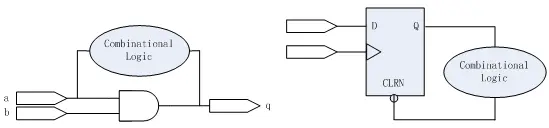
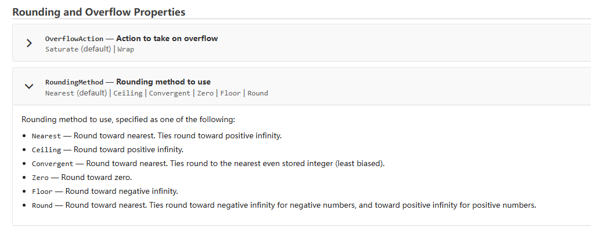

# 项目技术总结 #

## RTL Coding
- #### 同一个Always block不要对多个信号赋值，容易导致变量在不同分支中漏赋值
- #### 单bit与多bit &/&&逻辑
  ```
  // 错误的写法
  assign rg_int_clr[11:0] = enable & reg_data[11:0];//综合出来只有rg_int_clr[0]，其他bit恒为0，被优化
  assign rg_int_clr[11:0] = enable && reg_data[11:0];//编译器认为是算术逻辑，会将双目都整形为{True,False}再作算术逻辑，结果只有1bit{True,False}
  // 正确的写法
  assign rg_int_clr[11:0] = {12{enable}} & reg_data[11:0];
  assign rg_int_clr[11:0] = enable? reg_data[11:0]:12'd0;
  ```
- #### FSM书写
  ```
  // 错误写法
  always@(*) begin
    if(~rstn) state_n = IDLE; // ERROR!!!!!!!
    // 绝对错误，reset不能融入组合逻辑，会形成组合逻辑环
    else begin
      case(state_c) 
        IDLE: state_n = xx;
        READ: state_n = xx;
        ……
        default: state_n = IDLE;
      endcase
    end
  end
  // 正确写法
  always@(*) begin
    state_n = IDLE; //防止跑飞，先给初态
    case(state_c) 
      IDLE: state_n = xx;
      READ: state_n = xx;
      ……
      default: state_n = IDLE;
    endcase
  end
  ```
  reset不能融入逻辑，在```always_ff block中if(~rstn)```只是表示使用的是带复位的DFF，综合工作会自动识别后mapping到正确的器件，并不代表reset被融入了逻辑；如果在```always_comb block中使用if(~rstn)```，reset会被当做逻辑的一部分连到DFF的D端，形成组合逻辑环。
## 设计
- #### test mode的启动
  - 工作原理：用户启动test mode后，间隔一段时间，dft的scan_mode拉高，直到下一次硬件复位
  - PacificS做法：ad_porn或PAD_RSTN复位时，scan_mode拉低；当spi写入一段cmd后，scan_mode拉高；
  - CardiffB做法：ad_porn复位时，scan_mode和mbist_mode拉低；当PAD_IIC_EN输入的8bit序列为seq1时，scan_mode拉高，且输入序列的shift_clk被gate掉，即保持seq1直到复位；同理PAD_IIC_EN输入的8bit序列为seq2时，mbist_mode拉高……
  - CardiffC做法：用户对寄存器rg_dft_test_en软件W1C(因为CardiffC中reg用spi时钟，spi时钟不是常有的？但是硬件复位所有寄存器都会复位，好像也没有影响==>确认了一下，可以不是W1C)，同步到系统时钟域，delay一拍得到test_en_d1；用test_en_d1的posedge触发scan_mode；
    ```
    always@(posedge test_en_d1 or negedge rstn_hw) begin
        if(~rstn_hw)    dft_test_en <= 1'b0;
        else            dft_test_en <= 1'b1;
    end
    ```
    其中rstn_hw是模拟接过来的AD_POR_N，不能过scan
- #### DA接口不能有毛刺，尽量寄存器输出
  - 只能在后仿中概率性发现，需要在rtl阶段就注意；
  - DA信号尽可能寄存输出，如果必须组合逻辑，需要考虑是否有毛刺，并和ANA确认；
- #### 模块的clock&reset尽可能都在CRGU中产生并分配
  - 一方面方便DE修改和管理，另一方面方便DV验证和debug
- #### shut domain的所有reset都要收到shut_rstn的控制（CardiffB中）
  - shut reset域包括了shut domain的模块，以及从该模块出去的信号；
  - 示例：shut中模块A产生中断请求int，经过同步器送到alon的int_ctrl中，如果同步器的reset不受shut_rstn控制，那么shut掉点后int会是x态，可能产生错误中断；
- #### clock & reset
  - 如果某个MUX的sel信号是rg，且该rg收到MUX输出的时钟信号驱动，则需要在scan_mode下将该rg拉到固定值，否则在scan_mode下该rg的翻转（因为scan chain会shift所有寄存器）会导致MUX输出时钟有毛刺（虽然此时MUX的A1,A2都应该为scan_clk，但MUX有延迟）
- #### MPX的默认输出不要是clock信号
  - 虽然MPX只做dbg用，芯片正常工作时不会使能，但是mpx译码器如果默认选中clk这类高频跳变信号，会导致该电路内部有节点不停翻转，造成较大的功耗开销；因此尽量MPX默认输出静态的信号；
- #### 涉及通信的pinmux切换，需要考虑是否会影响通信接口正常工作或工作完
  - 比如SPI相关PAD不会被复用为MPX功能，但是可以复用为test功能
- #### PAD的控制必须在alon中完成，PAD default状态需要考虑应用场景和封装
  - 输入PAD的上下拉的作用？？？？？？？？？（保证万一IO出问题，不影响芯片内部吗？）
  - 比如CardiffBs中，3pin封装(i2c 2pin+int)IIC_SCL和IIC_SDA复用了PAD_CSN和PAD_MISO，必须pull low？否则i2c无法通信？？？？？？？？？？？为啥default接口必须是i2c？？？？？？？？？？？？
  - 比如CardiffC中，SYNC可能无法拉出来，因此不能复用为必要功能，复用为MPX时也不要用于观测重要信号
  - PAD的driver strength设置需要和提供PAD model的人员确认，driver越强，功耗较大（但驱动功能不会有风险），如果driver较小，可能不够驱动PAD，导致芯片挂掉；
- #### 时钟切换问题
  - 是动态切换(Bs)还是静态切换(Chelsea)?
  - 时钟切换的common cell是否有使用限制？
  - 过完TMUX的信号要过scan mux，因为在串链时rg会翻转，为了保证过稳定的scan_clk;
- #### 同步器要用common lib的sync，便于验证和cdc check能通过脚本或者工具抓取sync
- #### SPI时钟极性问题，以及要考虑SPI时钟存在问题
  - 当rg_cpha^rg_cpol=0时，选择spi_sck，否则选择spi_sck_inv
  - spi_sck只有在用户使用时才存在，要注意这一点（使用有效边沿，考虑到消失问题）
- #### 尽可能不要综合出常开的ckgt
  - 举例
  ```
  always@(posedge clk_alon or negedge rst_n) begin
    if(~rst_n)  
      tcnt <= 'd0;
    else if(condition)  //如果condition是一个常开的level，会有功耗开销；尽量修改为pulse；
      tcnt <= xx;
    else 
      tcnt <= xx;
  end
  ```
- #### 组合逻辑环问题
  
  - 产生原因：<br>产生组合逻辑环路的原因有两个，一个是将组合逻辑电路的输出端又通过组合逻辑反馈到输入端，另一个是将寄存器的输出端通过组合逻辑反馈到同一个寄存器的异步端（异步复位或异步置位）
  - 隐患：<br>
    - **毛刺、振荡与死锁**：组合逻辑环路违反了同步设计原则，两个reg之间如果有组合逻辑环路，如果该组合逻辑path等效成inv path，当path中inv为奇数个时，可能产生振荡和毛刺，造成timing vio甚至使得整个系统不稳定；如果path中inv为偶数个，正反馈容易造成电路死锁。
    - **依赖器件延时**：组合逻辑环路实现的逻辑功能完全依赖于环路上的逻辑门延迟和布线延迟，如果这些延迟发生变化，原来的逻辑功能将会发生彻底的改变，而且改变后的功能很难预测，所以这种设计基本没有可移植性。
    - **EDA参与不确定性**：组合逻辑环路会使设计软件进入无尽的环路计算中，为了完成计算，一些EDA工具会将环路割断，而不同的EDA软件对环路割断处理的过程是不尽相同的，这种过程不但使电路的实现偏离了最初的设计意图，而且使电路的实现呈现不确定性。另外，还有一些EDA工具都会将组合逻辑环路定义为一种设计错误，如果设计中存在这种逻辑，编译过程会报错，强制用户进行修改。
  - 必须避免:<br>crgu中碰到过，但那个非典型，经过分析可以waive掉，功能模块中一定要避免（正常情况下一般不会这么邪门，暂时没碰到妖怪功能会这么迷惑人去这么设计）

- #### 寄存器复位时必须赋constant value
  ```
  always@(posedge clk or negedge rstn) begin
    if(~rstn) 
      int_out <= 1'b0;  // constant value
      //int_out <= rg_int_low_en; // 达咩，后仿可能引起violation
    else
      ......
  end
  assign int_out_final = rg_int_low_en? ~int_out:int_out;
  ```
- #### SPI通信时CSN的deglitch
  为了避免csn的片选信号有毛刺，导致slave被误选中，因此一般需要对SPI的CSN做deglitch，避免串扰；
- #### SPI相关时刻要注意SCK的非常开性


## 数据处理

- #### signed和unsigned处理
  - 区别仅在于高位拓展时是填充0还是符号位
  - 尽量不要在同一句赋值语句中signed和unsigned混用

- #### 溢出判断、饱和处理
  - 溢出类型：正溢出、负溢出、零溢出
  - 溢出判断方式：符号位是否溢出
  - 饱和处理（一般来说）：正溢出-->MAX，负溢出-->MIN
  ```
  // 假设两个Nbit有符号数相减，判断溢出后做饱和处理 //
  logic signed [N-1:0] sub_a;
  logic signed [N-1:0] sub_b;
  logic signed [N:0] sub_c;
  logic signed [N-1:0] sub_c_sat;
  assign sub_c = sub_a - sub_b;
  assign ov_flag = (sub_c[N] != sub_c[N-1]);  //如果没有符号位溢出，真实符号位==截位符号位//
  assign sub_c_sat = ov_flag?  {sub_c[N],{(N-1){~sub_c[N]}}} : sub_c[N-1:0];
  //sub_c[N]才是真实符号位
  ```


- #### 四舍五入（rounding method）
  - 针对filmath函数中的rounding method @matlab，网站定义如下：
    
  - 首先要和算法确认四舍五入方式：nearest(default)、round、...
  - 主要讲常用的两种，区别在于“五入”时向正无穷大“入”（nearest），还是正/负两边无穷大“入”（round）
    ```
    /* 针对Nbit有符号数data截取高位Mbit，要求做四舍五入（一般还要考虑溢出饱和处理）*/
    logic signed [M:0] data_round;
    logic carry_bit;
    // nearest（default）
    assign carry_bit = data[N-M-1]; // 不考虑符号位
    assign data_round = data[N-1:N-M] + carry_bit;
    // round
    assign carry_bit = data[N-1]?  (data[N-M-1] && (|data[N-M-2:0])) : data[N-M-1]; //考虑符号位
    assign data_round = data[N-1:N-M] + carry_bit;
    // 溢出饱和处理（略）
    ```
  - Notioin：具体是什么method、处理细节需要和算法确认，rtl行为和算法提供的model一致，协助DV确认reference model和算法一致


## 仿真问题
- #### EDA工具的timing path问题
  - 现象：前仿波形中，由于一般不带延时，波形上来看同步电路的CK时钟边沿和D端信号跳变边沿是对齐的，EDA工具默认配置下会采集跳变前的数据，但在一些罕见情况下会采不到或者采错。此时需要在rtl里加入#，拖延D端信号跳变（可能会引入glitch，但无害），或者拖延DFF采集信号的时间点；
  - 可能原因：CK时钟和D端信号源时钟虽然是同步时钟，但rtl中其中一路可能经过了分频/gating/...处理，导致EDA误认为两者是异步时钟，因此屏蔽了common情况下的采集边沿配置，导致了采错。
  - 处理方式：由于该情况只会存在于不带延时的前仿，分析情况后在rtl中加#，或EDA工具中加option，引入的glitch经过分析可以ignored。由于综合时会对所有timing path做约束，后仿和实际电路中不会有时钟采错的问题。


## 交互
- DE需要理解模拟和系统需求的前因后果，DV需要自己理解后建model，多重理解多重验证，对其颗粒度哈；
- DE对于系统的需求不能想当然，要先熟悉模块，再品味细节和需求的前因后果，多方确认后再动手；