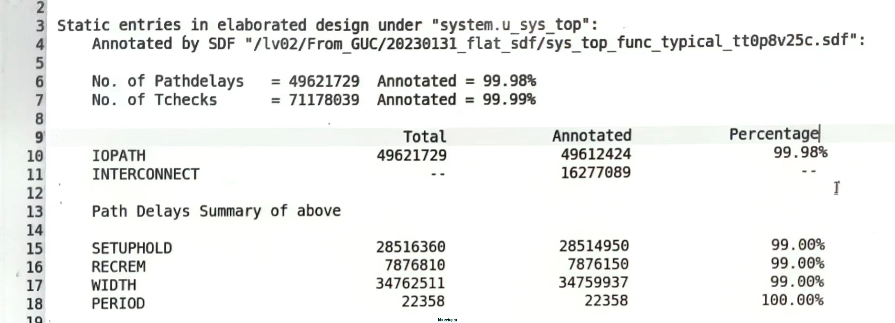
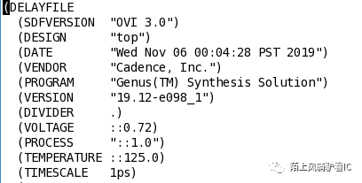
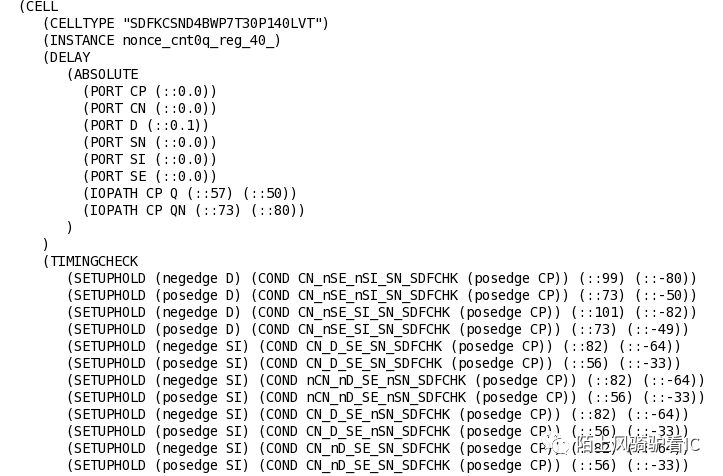
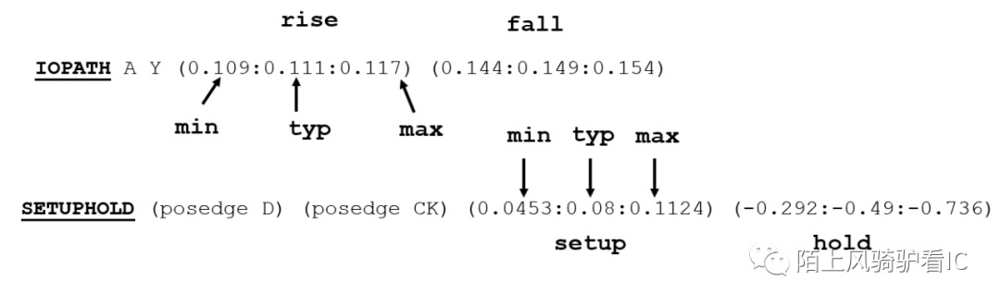

- 后仿真在流程中的作用
  - TODO
- 和前仿真的区别
  - TODO
- 从前仿到后仿的流程
  - DC综合/PT做STA
    - 脚本
    - 输出：门级网表.v，标准延时文件.sdf
  - 反标sdf
    - 符合反标（VCS和XRUN
    - 反标率（aci lib前加-v）
      - 可以在后仿编译脚本中加：vcs -sdf_verbose
      - 后仿真编译过后会生成sdfAnnotationInfo文件，里面会包含sdf反标率等信息

      >- 在$sdf_annotation中指明module inst后，会给出该inst下的反标率，类似
      
      >- 还会给一份elaborated design的反标率，在后仿吃filelist里的asic lib时必须使用-v，并且不要include没用过的ip lib，否则会把这些lib里的timing check都计算进总timing check数，导致SDF的反标率变低（深有体会）
      >- DC综合出的sdf中么得width信息，PT出的sdf有；
      >- write_sdf -version 3.0以上可以支持timing check为负值，且可以合并SETUPHOLD检查，不需要-neg_tchk去将负值变0（old ver需要，否则报warning）

    - 反标率低的常见问题debug
      - 检查write sdf的脚本的路径、文件、lib是否正确；
      - 反标的module inst是否正确；
      - 后仿吃的lib是否有多余的，导致反标率低；
      - 反标时选择的MAX/TYP/MIN是否在sdf中有对应的数据
        - CardiffC中碰到过：后仿TYP corner时，波形delay都是整数倍ns，且和后端timing rpt不符合；而MAX和MIN corner都正常；
        - dbg发现：吃的sdf等文件正确，sdf反标率很高
        - dbg结果：后端的sdf中只提供了MAX和MIN，没有TYP数据，导致反标时没有在sdf中找到对应TYP数据，直接用了model中specify的数值，导致反标率高但没标上后端delay和check数据；

    - sdf的内容
      - 文件构成
        - 表头（版本、top、EDA、PVT等信息）
        
        - Cell Delay信息（Instance信息、IOPATH、Timing Check）
        
        > IOPATH与Timing check
        >
        >- IOPATH指的是该timing arc的起点-->终点delay(pin2pin)；分别对应rise和fall在min、typ、max下的delay；
        >- SETUPHOLD指的是相对寄存器CK的posedge/negedge，检查寄存器D端在posedge/negedge时需要满足的setup和hold时间；
        - Net Delay信息（Instance信息、Interconnect）
          - 器件之间的线延时，比如din1_reg/Q到din2_reg/D
          - 综合后、PR前导出的sdf中interconnect=0；
          - PR后read spef后导出的sdc中interconnect=真实net delay；
      - Path Delays
        - IOPATH
        - INTERCONNECT
      - Timing Checks
        - SETUP
        - HOLD
        - WIDTH
        - PERIOD
        - RECOVERY
        - REMOVE
        - ...
  - 后仿真选项
    - https://blog.csdn.net/Shu_0223/article/details/106137566
    - +nospeicy
    在仿真时忽略库文件中指定的time unit的延时。
    - +delay_mode_zero
    将标准库单元中定义的延时替换为0。testbench中的 #delay 也都被消除。
    - +notimingcheck
    时序检查开关，比如setup/hold/width检查等等，如使用了该option，则仿真时不检查时序，行为类似于RTL仿真。前仿时可用该选项忽略延时，用于功能性的粗略检查。跑后仿真时，不可使用该选项。
    可使用tfile来将特定的路径加到no timing check list file中。建立notimingcheck.cfg文件,把违例的路径按格式
        >instance {t_test.i_all.i_top.i_xx} {noTiming};

        添加到notimingcheck.cfg文件中，在编译compile的时候加入命令
        > vcs  +optconfigfile+../notimingcheck.cfg 

        如果timing check检查到violation，会报告在sim.log中，且波形中有X态；
        特定可以免于check的path，比如sync的第一级，在RTL coding中该类同步器最好使用common lib cell，就可以用脚本抽取sync的第一级放入tfile；

- 后仿真需要check的内容（后仿实际上是动态时序分析，主要check timing）
  - 是否有timing violation【主要是异步电路之间的】 **（STA只能check同步电路的timing，异步电路的分析只能通过spyglass cdc check【理论check】和后仿真【实际check】来检查）**
    - 检查项：
      - sim.log的timing violation info和wave中X态；
    - 可能产生violation的原因：
      - 检查syn和STA中的violation是否都消掉了；
      - 后仿的PVT和frequence是否below constrain，如果实际后仿clk freq比综合&STA的约束中要高，那么综合出的电路是有可能无法满足timing的；需要refine约束条件；
      - model中是否有无复位的reg(->X)，未被驱动的PAD口(->Z)；
      - EDA工具在mapping到netlist时可能把信号名改了（综合时用option去规避）
  - 功能正确性（with real delay）
    - 钱后仿func是否一致；前仿中dv会对电路进行较为完备的func verification，后仿主要关注时序，但还是需要check带delay的功能正确性；
    - 后仿消耗时间更长，加上dv的assert等会更加消耗runtime；

- 延时信息问题的讨论与总结
  - RTL级
    - 仿真中带延时，一般通过代码中加#delay
    - 不带引入specify，因为寄存器不是最小单元，且很难对抽象的逻辑描述绑定延时；
      - specify一般存在于gate-level级仿真模型中，比如stdcell、各种ip等；
      - RTL-->翻译到gate-level verilog-->map到stdcell的netlist（即综合过程）；
      - 仿真该netlist时可以调用stdcell的gate-level级仿真模型，即可以带上延时信息；
  - 综合后、PR前
    - 可以得到门级网表，但会clock tree和net都是通过模型近似的；
    - 综合工具DC，STA工具PT都可以得到sdf，内部包含计算好的pin2pin的delay值
    - sdf是中后端根据sdc约束完timing之后更准确的延迟信息。
    - sdf反标在有specify的地方。sdf与specify的延迟不一致时以sdf为准，没有sdf的地方使用specify的延迟信息。
  - PR后
    - PR后的网表包含了真实的clock tree，更真实；
    - PR后会生成spef文件（starRC抽取的RC寄生信息），内部只包含net delay；
    - 用PT读取spef后，得到sdf，内部包含cell delay和net delay；
    - 此处的sdf比PR前更完备（？