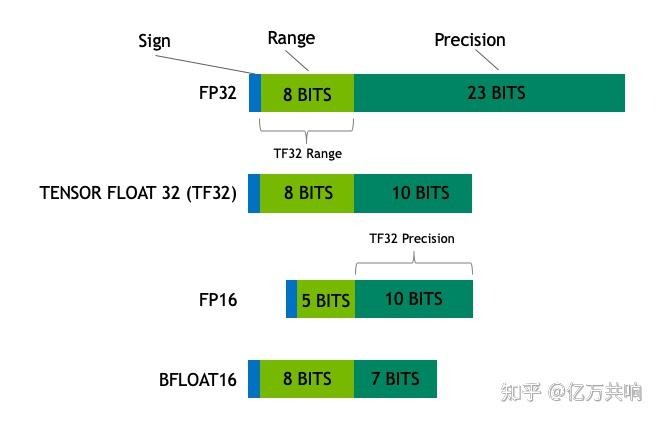

# 高性能技术总结 #

## memory相关
### access time
- 需要提前查阅memory的datasheet中的read-cycle timing和write-cycle timing，确定读/写成功需要几个cycle；
- 读cycles影响采样`rdata`的时序：mem的clock采样到cen、wen、addr后的第几个clock边沿rdata稳定？
- 写cycles影响RAW的场景，如果写成功需要N cycle，那么不能在写之后的N cycle之内读取同一个地址，否则会读出旧数据；
- 基于TSMC22nm，SRAM的access time大约为1.x~ns左右，因此`rdata`会在clock采样到读控制(T0)后的2ns左右稳定，对于480Mhz的系统频率，即使不考虑`rdata -> reg`路径上的逻辑（比如RAM和多个module之间的MUX），在T0->T1期间直接使用rdata得到read_data（比如经过一些condition MUX），在T1时采样read_data，那timing也会很差；因此建议在T0->T1阶段不建议经过逻辑，在T1时直接采样rdata，在T1->T2阶段再对rdata做处理，timing会更容易收敛；
- 同理，对于`wdata`，由于module的wdata->RAM可能会经过MUX或不良布线，建议module端的wdata也要寄存后给出；
- 总结：
  - 提前查阅datasheet；
  - module端输出的读写控制信号都经过寄存器给出；
  - module端输入的读数据先直接寄存，再做处理；
  - 虽然module的控制会复杂，会增加一些打拍逻辑和寄存器，但是高性能设计中timing会更容易收敛；
  
### 杂项
- 仿真阶段，如果RAM model是latch搭的（比如RF），xrun仿真时会认为`rdata`同拍出，此时要加#1或者修改仿真option来模拟RAM的真实行为；
- 小容量的RAM，RF比SRAM的面积会更好（具体还要查阅手册）
- 8.5KB(512x136)的SRAM面积(不带PR)大约21000um2（RF），25000um2（SRAM）

## 定点 vs 浮点
- 概念：
  - 计算机中如何表示小数？
  - 定点和浮点都能表示小数和整数；
  - 点可以理解为小数点，定点的小数点位置是“固定的、约定的”，划分的是整数和小数区域；比如8位定点数`SXX.xxxxx`，整数部分的表达范围只有-4~3，小数部分的精度也有限；浮点的小数点含义类似于科学计数法，划分的是指数和尾数区域；比如8位浮点数`SXX(.)xxxx`,表示的数为1.xxxx * 2^(XX-3)，表示范围更大更灵活；
- 常用浮点：
    
    - 以FLOAT32为例，精度有24位（1.xxx...x，有23个x，加上1.，就是24个有效位，只不过1.是固定的），阶码偏移=最大阶码为127(2^(8-1)-1)，FLOAT32的表达范围~1.18e-38 … ~3.40e38，精度为 6-9 位有效小数；
- 浮点-定点转换：
  - 仍然以FLOAT32为例，9.625转成bin：1001.101，转成1.001101 * 2^3， 因此符号位为0，阶码为3，加上阶码偏移=3+127=130，尾数为1.001101，转成FLOAT32的二进制表达为：0 10000010 001101(0...0)；
  - 反之，类似；
- 应用：
```
#if FLOAT32_QUANT
    nSum = (int32_t)(pfScaleSumPt[i] * nSum + pfBzpPt[i]);  
    // nSum: int32, pfScaleSumPt: float32, pfBzpPt: float32
#else
    nSum = (int32_t)((plnOutMult[i] * nSum + plnOutMultBzp[i]) >> puchOutShift[i]); 
    // nSum: int32, plnOutMult: int64, plnOutMultBzp: int64, puchOutShift: uint8
#endif
```
`以下数据为TSMC22下DC综合结果，不带MUX和LVT`


|DW算子|delay (ns)|area (µm²)|
| ---- | ----- | ----- | 
|DW_i2flt   |0.63|271 |
|DW_fp_mult |1.29|1061|
|DW_fp_mac  |1.94|1933|
|DW_mult(fix64x32)|1.83 ns|1557|

#### 定点量化硬件实现过程：
- cycle1：MULT64X32[>1.83ns]-> `关键路径`
- cycle2：ADD->shift->clip->
- cycle3：得到puchout结果写回memory

#### 浮点量化硬件实现过程1：
- cycle1：nSum定点转浮点DW_i2flt[0.63ns]->和pfScaleSumPt做浮点相乘DW_fp_mult[>1.29ns]-> `关键路径`
- cycle2：和pfBzpPt做浮点相加 DW_fp_add->浮点结果转定点DW_flt2i后clip->
- cycle3：得到puchout结果写回memory

#### 浮点量化硬件实现过程2：
- cycle1：nSum定点转浮点DW_i2flt[0.63ns]-> 
- cycle2：和pfScaleSumPt、pfBzpPt做浮点乘相加 DW_fp_mac[>1.94ns]->浮点结果转定点DW_flt2i后clip-> `关键路径`
- cycle3：得到puchout结果写回memory

#### 浮点量化硬件实现过程3：（改动大）
- cycle1：已经定点转浮点的nSum(retiming)和pfScaleSumPt做浮点相乘DW_fp_mult[>1.29ns]-> `关键路径`
- cycle2：和pfBzpPt做浮点相加 DW_fp_add->浮点结果转定点DW_flt2i后clip->
- cycle3：得到puchout结果写回memory

## 有符号 vs 无符号
### 扩展
计算赋值的步骤如下：（接口赋值同理）
- 根据赋值位长确定原则，确定RHS的位长
- 赋值时，如果RHS的位长小于LHS的位长，就扩展RHS。不管LHS的符号是什么，扩展时都不考虑LHS的符号，`只有当RHS是signed，才做符号扩展`。
- 赋值时，如果RHS的位长大于LHS的位长，那么直接把`高位截断`，以匹配LHS的位长。（有可能把符号位截去）
- `总结：扩展0/1以右为尊，位长以左为尊`
```
// example
logic [7:0]         u8  = 8'hff;    // FF, 符号位=0
logic signed [7:0]  i8  = -8'sh01;  // FF, 符号位=1
logic signed [15:0] i16 = u8;       // 00FF, 根据RHS的signedness做扩展
logic [15:0]        u16 = i8;       // FFFF, 根据RHS的signedness做扩展
// 最优写法
logic signed [15:0] i16_1 = $signed(u8);  // FFFF
logic [15:0]        u16_1 = $unsigned(i8);// 00FF
```
### 移位
- $>>$：逻辑右移（高位补 0）
- $>>>$：算术右移（若左操作数是 signed，高位补符号位）

### 比较
- 如果是两个signed比较：就写两边都 $signed()
- 如果是两个unsigned比较：就写两边都 $unsigned()
- 真要混合：先显式扩到共同位宽/共同域再比较，别直接写 $unsigned(a) > $signed(b)
  - 建议拓展到signed域，两边位宽需要>= width(unsigned data)+1，高位用于补0（作为符号位）；
  - 或者根据signed data的符号位确定正负，如果为正，转成unsigned去比较；
  - 
### 拼接与切片
- 拼接 {a,b} 的结果通常是 unsigned（即使 a/b 是 signed）
- 切片 a[7:0] 取出来也经常变成 unsigned 

## 怎样才是好的timing？如何预先评估timing？
- coding时给拿不准需要几拍的逻辑预留修改逻辑，比如rdata、大位宽乘法器、除法器等，通过parameter设定multicycles，通过vld来标志下一级数据流的有效采样时间；
- 在合适的场景下善用Flow(valid, payload)或者Stream(ready, valid, payload)来处理数据流；
- 需要考虑隐含的组合逻辑path，比如if else中的condition，也会引入很多MUX；当寄存器width较大时MUX的影响难以忽略；
- TSMC22nm，sdc 480Mhz时，普通cell的延时大约<0.02ns~0.06ns>，DFF面积大约<2.5~ um2>;
- 善于预综合，用最简单的脚本，不使用LVT，不使用激进的优化选项，预估timing；